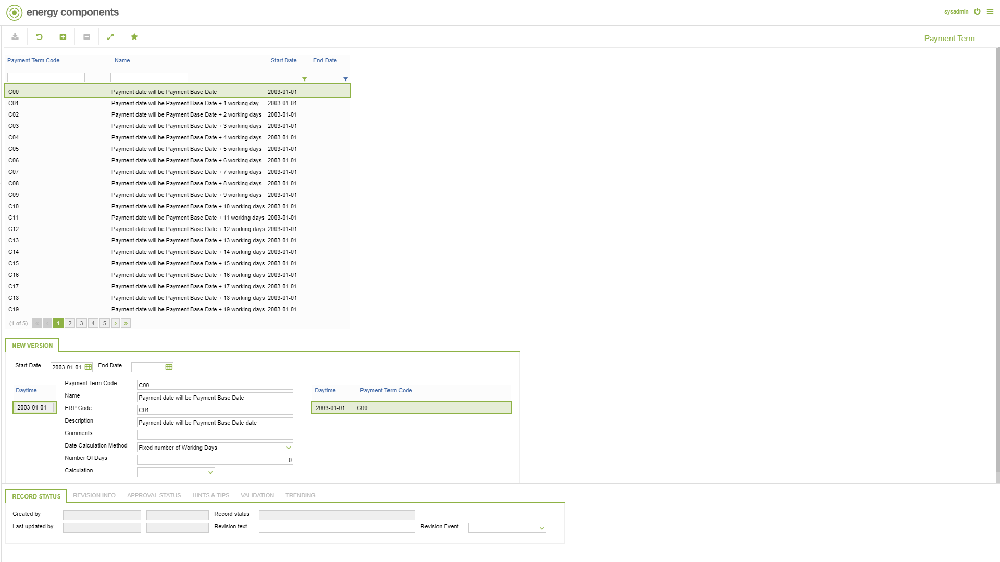
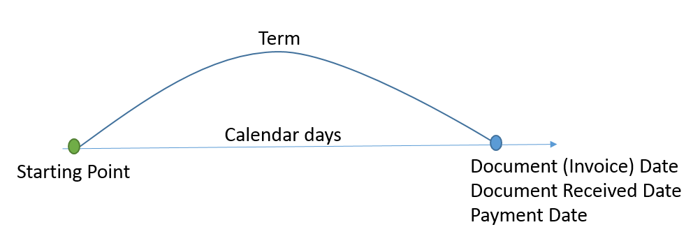

# CD.0023 - Payment Term

_Deep-dive 2026-07-05 (deterministic runner). Module: CD._

## Identity
- BF_CODE: CD.0023 - URL: `/com.ec.frmw.co.screens/manage_object_nav/CLASS_NAME/PAYMENT_TERM`

## DB binding (metadata-resolved)
| Class | Type/Scope | Base table | View |
|---|---|---|---|
| `PAYMENT_TERM` | OBJECT/VERSIONED | `PAYMENT_TERM` | `OV_PAYMENT_TERM` |

_Resolved by: url CLASS_NAME_

## Screen type
OV (master-data object)

## Help (screen screenshot -- local online-help corpus 14.2.5)

## Help (field-description images -- local online-help corpus 14.2.5)

