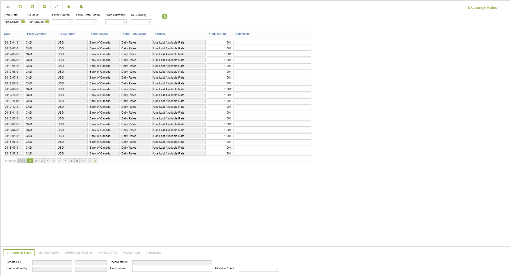

# CD.0028 - Exchange Rates

_Deep-dive 2026-07-05 (deterministic runner). Module: CD._

## Identity
- BF_CODE: CD.0028 - URL: `/com.ec.revn.cd/ex_rates`

## DB binding (metadata-resolved)
| Class | Type/Scope | Base table | View |
|---|---|---|---|
| `EXCHANGE_RATE` | DATA/MTH | `CURRENCY_EXCHANGE` | `DV_EXCHANGE_RATE` |

_Resolved by: label (exact, unique)_

## Screen type
DATA/MTH

## Help (screen screenshot -- local online-help corpus 14.2.5)

## Help (field-description images -- local online-help corpus 14.2.5)
_(no field-description images in corpus for this BF_CODE)_
