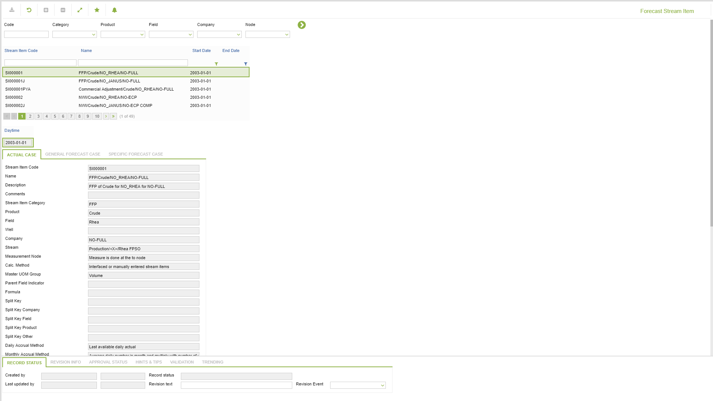
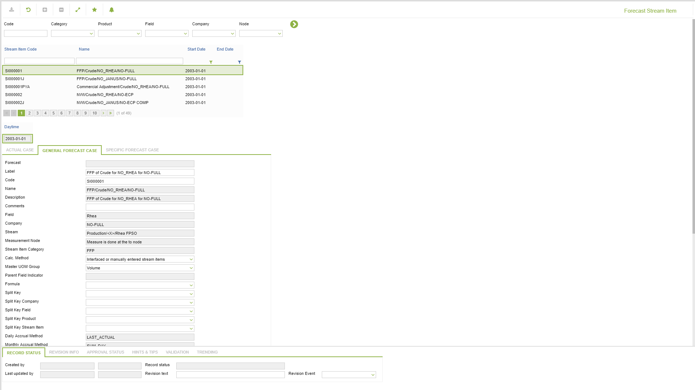
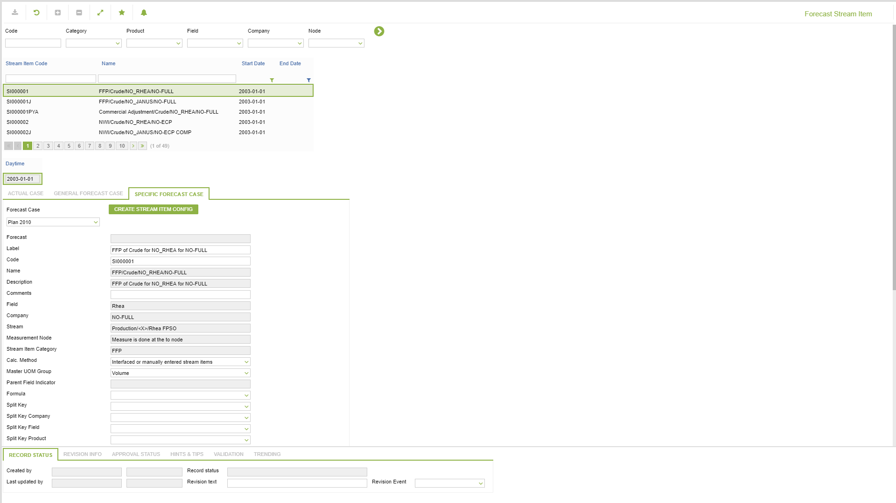

# CD.0116 - Forecast Stream Item

_Deep-dive 2026-07-05 (deterministic runner). Module: CD._

## Identity
- BF_CODE: CD.0116 - URL: `/com.ec.revn.cd/fcst_stream_item_setup`

## DB binding (metadata-resolved)
| Class | Type/Scope | Base table | View |
|---|---|---|---|
| `FCST_STREAM_ITEM_SETUP` | DATA/DAY | `STIM_FCST_SETUP` | `DV_FCST_STREAM_ITEM_SETUP` |

_Resolved by: url path token_

## Screen type
N1 daily-status grid

## Help (screen screenshot -- local online-help corpus 14.2.5)

## Help (field-description images -- local online-help corpus 14.2.5)
_(no field-description images in corpus for this BF_CODE)_
