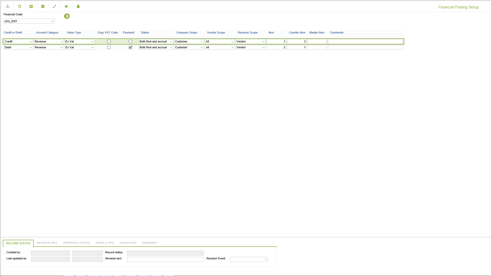

# CD.0119 - Financial Posting Setup

_Deep-dive 2026-07-05 (deterministic runner). Module: CD._

## Identity
- BF_CODE: CD.0119 - URL: `/com.ec.revn.cd/fin_posting_setup`

## DB binding (metadata-resolved)
| Class | Type/Scope | Base table | View |
|---|---|---|---|
| `FIN_POSTING_SETUP` | TABLE/EVENT | `FIN_POSTING_SETUP` | `TV_FIN_POSTING_SETUP` |

_Resolved by: url path token_

## Screen type
TV (table-class)

## Help (screen screenshot -- local online-help corpus 14.2.5)

## Help (field-description images -- local online-help corpus 14.2.5)
_(no field-description images in corpus for this BF_CODE)_
