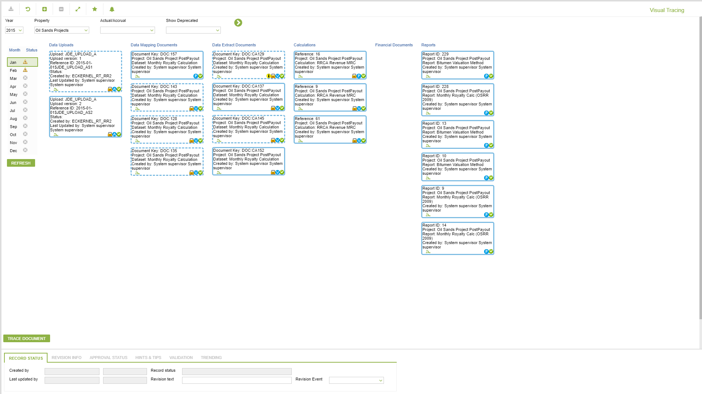
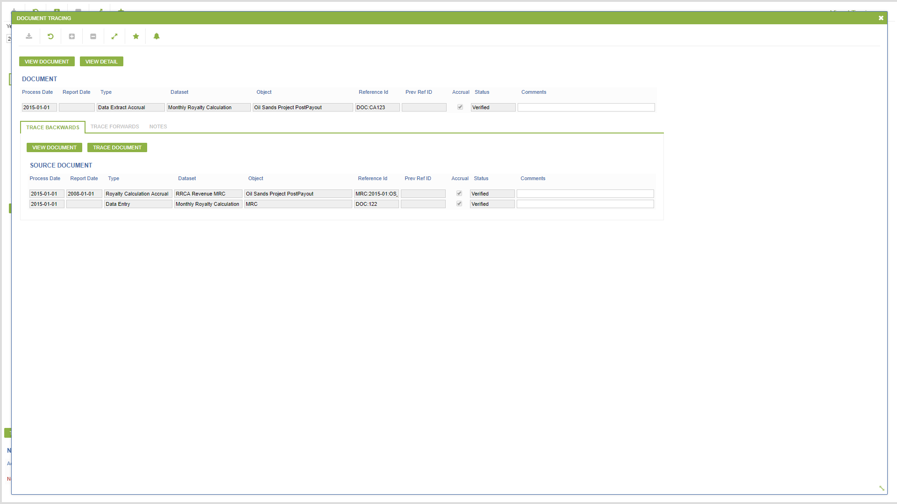
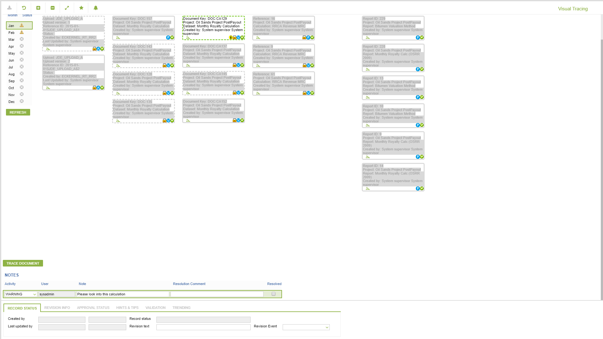

# CD.0152 - Visual Tracing

_Deep-dive 2026-07-05 (deterministic runner). Module: CD._

## Identity
- BF_CODE: CD.0152 - URL: `/com.ec.revn.cd/visual_tracing/DATA_CLASS/VISUAL_TR_ALL_DATA/HIGHLIGHT_CLASS/VISUAL_TR_HIGHLIGHT/CONFIG_CLASS/VISUAL_TR_CONFIG/YEAR_STATUS_CLASS/VISUAL_TR_YEAR_STATUS/TR_AREA_CODE/OIL_SANDS/PROJECT_HIDE_IND/Y/PROCESS_HIDE_IND/Y`

## DB binding (metadata-resolved)
| Class | Type/Scope | Base table | View |
|---|---|---|---|
| (no class resolved from URL/LABEL) | | | |

_Resolved by: not resolved_

## Screen type
process/config (no data class -- e.g. a process trigger, rule/formula editor or combination screen)

## Help (screen screenshot -- local online-help corpus 14.2.5)

## Help (field-description images -- local online-help corpus 14.2.5)

