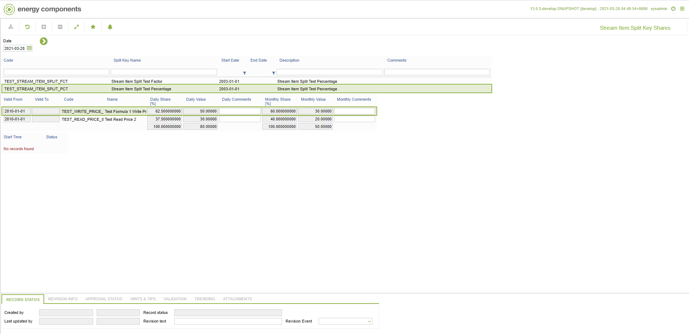

# CD.0157 - Stream Item Split Key Shares

_Deep-dive 2026-07-09 (deterministic runner). Module: CD._

## Identity
- BF_CODE: CD.0157 - URL: `/com.ec.revn.cd/stream_item_split_key/SPLIT_TYPE/STREAM_ITEM_SPLIT`

## DB binding (metadata-resolved)
| Class | Type/Scope | Base table | View |
|---|---|---|---|
| `STREAM_ITEM_SPLIT` | INTERFACE/VERSIONED | `None` | `RV_STREAM_ITEM_SPLIT` |

_Resolved by: url path token_

## Screen type
OV (interface/object screen)

## Help (screen screenshot -- local online-help corpus 14.2.5)

## Help (field-description images -- local online-help corpus 14.2.5)
_(no field-description images in corpus for this BF_CODE)_
