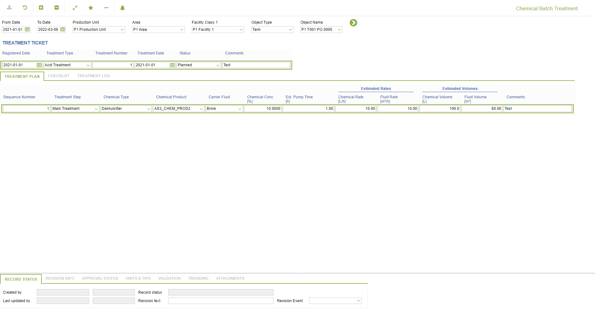
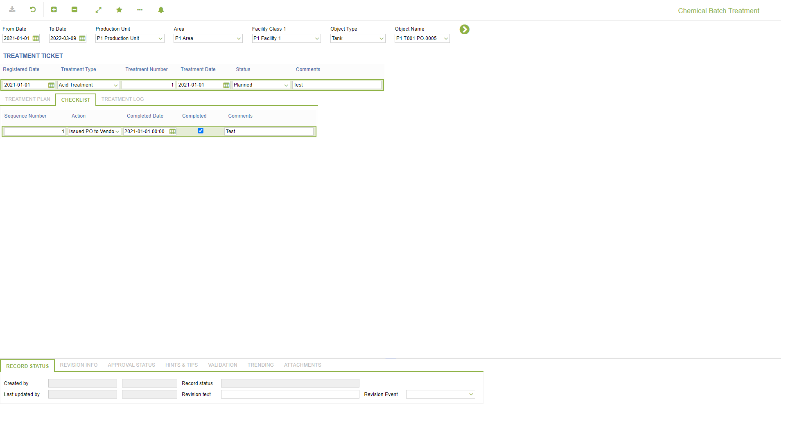
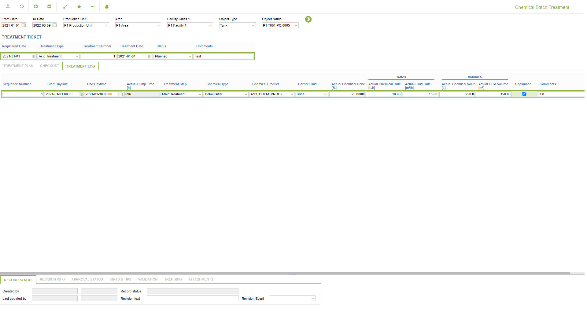

# CM.0005 - Chemical Batch Treatment

_Deep-dive 2026-07-07 (deterministic runner). Module: CM._

## Identity
- BF_CODE: CM.0005 - URL: `/com.ec.chem.cm.screens/chem_batch_treatment`

## DB binding (metadata-resolved)
| Class | Type/Scope | Base table | View |
|---|---|---|---|
| `CHEM_BATCH_TREATMENT` | TABLE/NONE | `CHEM_BATCH_TREATMENT` | `TV_CHEM_BATCH_TREATMENT` |

_Resolved by: url path token_

## Screen type
TV (table-class)

## Help (screen screenshot -- local online-help corpus 14.2.5)

## Help (field-description images -- local online-help corpus 14.2.5)
_(no field-description images in corpus for this BF_CODE)_
