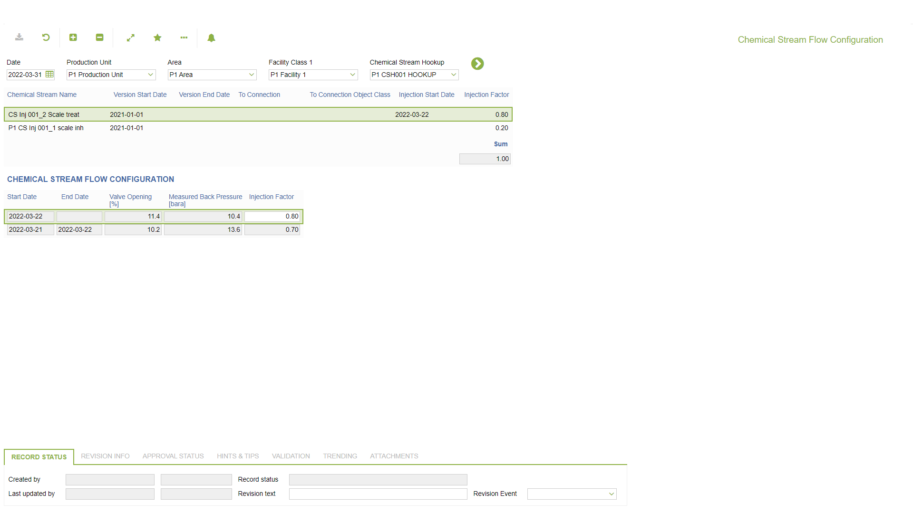
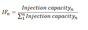
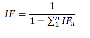

# CM.0006 - Chemical Stream Flow Configuration

_Deep-dive 2026-07-07 (deterministic runner). Module: CM._

## Identity
- BF_CODE: CM.0006 - URL: `/com.ec.chem.cm.screens/chem_stream_flow_config`

## DB binding (metadata-resolved)
| Class | Type/Scope | Base table | View |
|---|---|---|---|
| (no class resolved from URL/LABEL) | | | |

_Resolved by: not resolved_

## Screen type
process/config (no data class -- e.g. a process trigger, rule/formula editor or combination screen)

## Help (screen screenshot -- local online-help corpus 14.2.5)

## Help (field-description images -- local online-help corpus 14.2.5)

