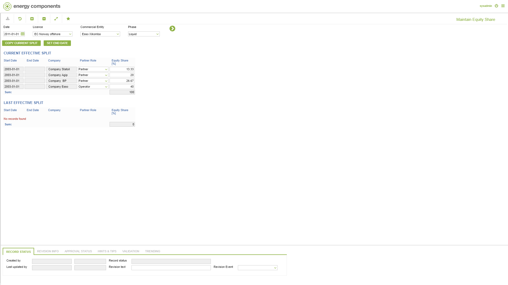

# CO.0018 - Maintain Equity Share

_Deep-dive 2026-07-05 (deterministic runner). Module: CO._

## Identity
- BF_CODE: CO.0018 - URL: `/com.ec.prod.co.screens/maintain_equity_share`

## DB binding (metadata-resolved)
| Class | Type/Scope | Base table | View |
|---|---|---|---|
| `EQUITY_SHARE` | DATA/EVENT | `EQUITY_SHARE` | `DV_EQUITY_SHARE` |

_Resolved by: url path token_

## Screen type
DATA/EVENT

## Help (screen screenshot -- local online-help corpus 14.2.5)

## Help (field-description images -- local online-help corpus 14.2.5)
_(no field-description images in corpus for this BF_CODE)_
