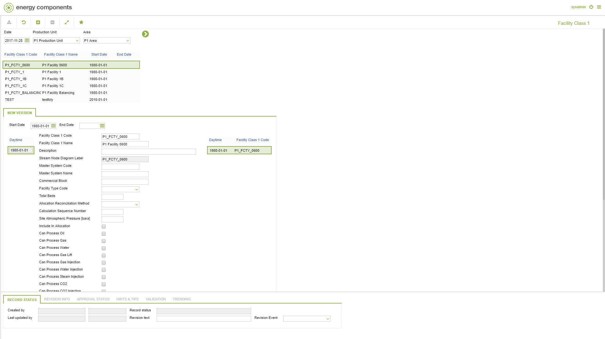

# CO.0019 - Facility Class 1

_Deep-dive 2026-07-05 (deterministic runner). Module: CO._

## Identity
- BF_CODE: CO.0019 - URL: `/com.ec.frmw.co.screens/manage_object_groupmodel_nav/GROUPMODEL/FCTY_CLASS_1/TARGET/FCTY_CLASS_1/CLASS_NAME/FCTY_CLASS_1`

## DB binding (metadata-resolved)
| Class | Type/Scope | Base table | View |
|---|---|---|---|
| `FCTY_CLASS_1` | OBJECT/VERSIONED | `PRODUCTION_FACILITY` | `OV_FCTY_CLASS_1` |

_Resolved by: url CLASS_NAME_

## Screen type
OV (master-data object)

## Help (screen screenshot -- local online-help corpus 14.2.5)

## Help (field-description images -- local online-help corpus 14.2.5)
_(no field-description images in corpus for this BF_CODE)_
