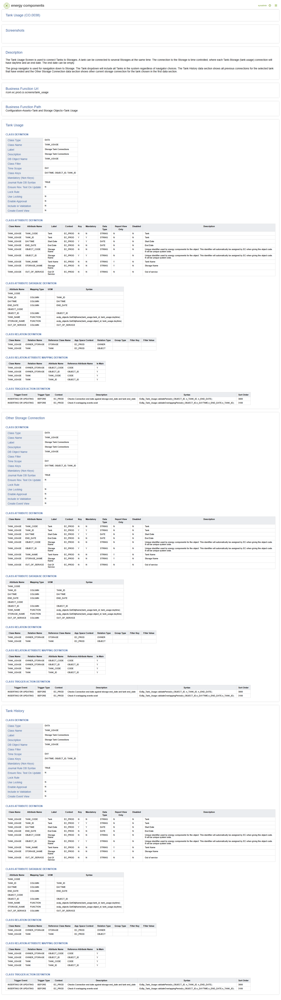

# CO.0038 - Tank Usage

_Deep-dive 2026-06-25 (deterministic runner). Module: CO._

## Identity
- BF_CODE: CO.0038 - URL: `/com.ec.prod.co.screens/tank_usage`

## DB binding (metadata-resolved)
| Class | Type/Scope | Base table | View |
|---|---|---|---|
| `TANK_USAGE` | DATA/DAY | `TANK_USAGE` | `DV_TANK_USAGE` |

_Resolved by: url path token_

## Screen type
N1 daily-status grid

## Help (description)
The Tank Usage Screen is used to connect Tanks to Storages. A tank can be connected to several Storages at the same time. The connection to the Storage is time controlled, where each Tank-Storage (tank usage) connection will have daytime and an end date. The end date can be empty.

The group navigator is used for navigation down to Storage. The Tank dropdown will include all Tanks in the system regardless of navigator choices. The Tank History data section shows all previous connections for the selected tank that have ended and the Other Storage Connection data section shows other current storage connection for the tank chosen in the first data section.

## Help (screenshot)

