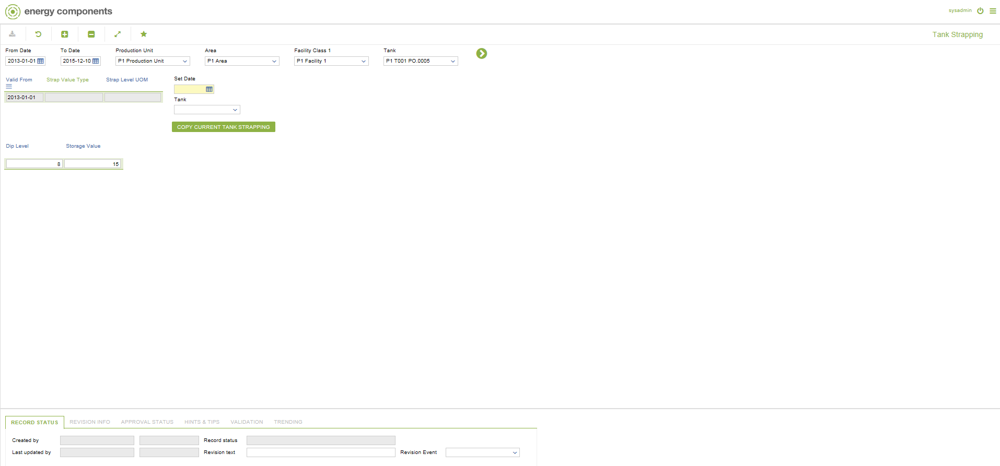

# CO.0039 - Tank Strapping

_Deep-dive 2026-07-05 (deterministic runner). Module: CO._

## Identity
- BF_CODE: CO.0039 - URL: `/com.ec.prod.co.screens/tank_strapping`

## DB binding (metadata-resolved)
| Class | Type/Scope | Base table | View |
|---|---|---|---|
| `TANK_STRAPPING` | DATA/EVENT | `TANK_STRAPPING` | `DV_TANK_STRAPPING` |

_Resolved by: url path token_

## Screen type
DATA/EVENT

## Help (screen screenshot -- local online-help corpus 14.2.5)

## Help (field-description images -- local online-help corpus 14.2.5)
_(no field-description images in corpus for this BF_CODE)_
