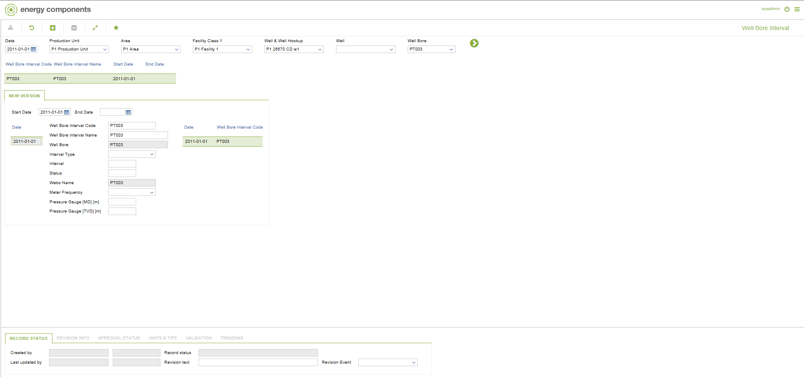

# CO.0057 - Well Bore Interval

_Deep-dive 2026-07-05 (deterministic runner). Module: CO._

## Identity
- BF_CODE: CO.0057 - URL: `/com.ec.prod.co.screens/well_bore_interval_maintain`

## DB binding (metadata-resolved)
| Class | Type/Scope | Base table | View |
|---|---|---|---|
| `WELL_BORE_INTERVAL` | OBJECT/VERSIONED | `WEBO_INTERVAL` | `OV_WELL_BORE_INTERVAL` |

_Resolved by: label (exact, unique)_

## Screen type
OV (master-data object)

## Help (screen screenshot -- local online-help corpus 14.2.5)

## Help (field-description images -- local online-help corpus 14.2.5)
_(no field-description images in corpus for this BF_CODE)_
