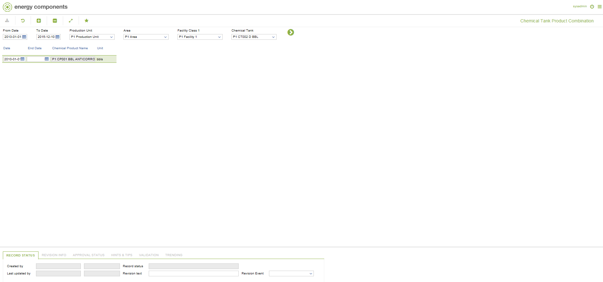

# CO.0074 - Chemical Tank Product Combination

_Deep-dive 2026-07-02 (deterministic runner). Module: CO._

## Identity
- BF_CODE: CO.0074 - URL: `/com.ec.prod.co.screens/chem_tank_product`

## DB binding (metadata-resolved)
| Class | Type/Scope | Base table | View |
|---|---|---|---|
| `CHEM_TANK_PRODUCT` | DATA/EVENT | `CHEM_TANK_PRODUCT` | `DV_CHEM_TANK_PRODUCT` |

_Resolved by: url path token_

## Screen type
DATA/EVENT

## Help (screen screenshot -- local online-help corpus 14.2.5)

## Help (field-description images -- local online-help corpus 14.2.5)
_(no field-description images in corpus for this BF_CODE)_
