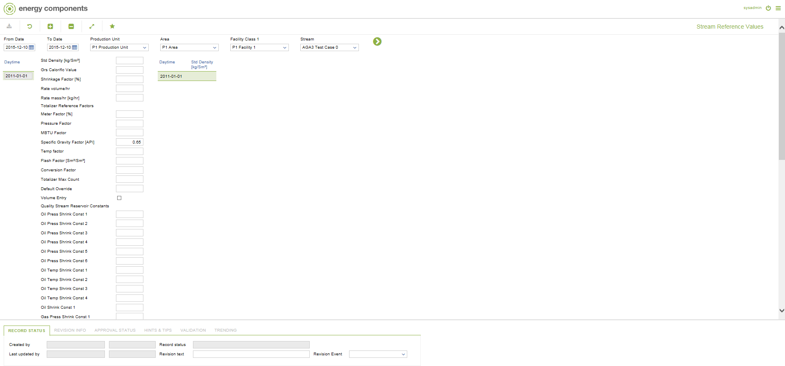

# CO.0086 - Stream Reference Values

_Deep-dive 2026-07-02 (deterministic runner). Module: CO._

## Identity
- BF_CODE: CO.0086 - URL: `/com.ec.prod.co.screens/stream_reference_value`

## DB binding (metadata-resolved)
| Class | Type/Scope | Base table | View |
|---|---|---|---|
| (no class resolved from URL/LABEL) | | | |

_Resolved by: not resolved_

## Screen type
process/config (no data class -- e.g. a process trigger, rule/formula editor or combination screen)

## Help (screen screenshot -- local online-help corpus 14.2.5)

## Help (field-description images -- local online-help corpus 14.2.5)
_(no field-description images in corpus for this BF_CODE)_
