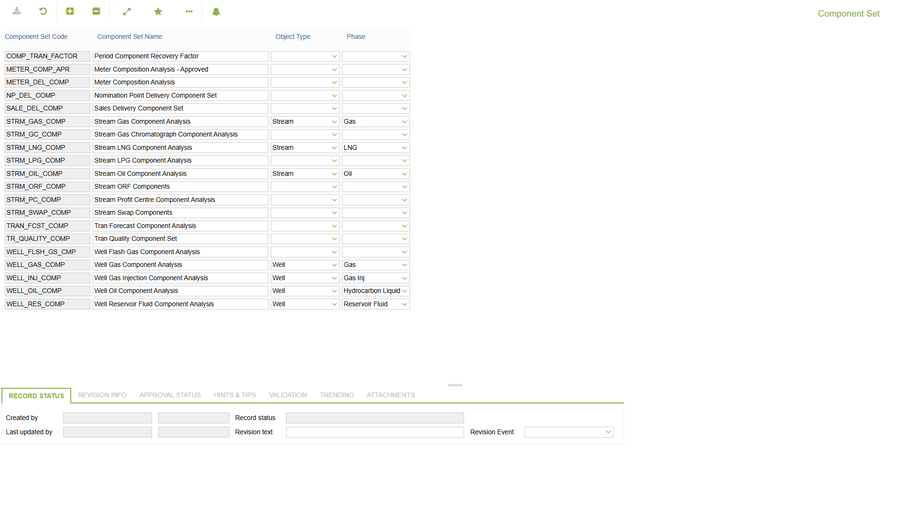

# CO.0087 - Component Set

_Deep-dive 2026-07-02 (deterministic runner). Module: CO._

## Identity
- BF_CODE: CO.0087 - URL: `/com.ec.prod.co.screens/comp_set`

## DB binding (metadata-resolved)
| Class | Type/Scope | Base table | View |
|---|---|---|---|
| `COMPONENT_SET` | TABLE/EVENT | `COMP_SET` | `TV_COMPONENT_SET` |

_Resolved by: label (exact, unique)_

## Screen type
TV (table-class)

## Help (screen screenshot -- local online-help corpus 14.2.5)

## Help (field-description images -- local online-help corpus 14.2.5)
_(no field-description images in corpus for this BF_CODE)_
