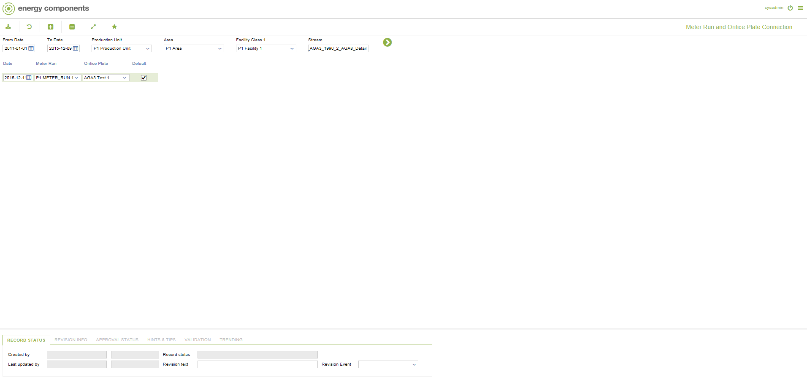

# CO.0093 - Meter Run and Orifice Plate Connection

_Deep-dive 2026-07-02 (deterministic runner). Module: CO._

## Identity
- BF_CODE: CO.0093 - URL: `/com.ec.prod.co.screens/maintain_meter_run_orifice_plate`

## DB binding (metadata-resolved)
| Class | Type/Scope | Base table | View |
|---|---|---|---|
| `METER_RUN_ORIFICE_PLATE` | TABLE/NONE | `STRM_AGA_CONNECTION` | `TV_METER_RUN_ORIFICE_PLATE` |

_Resolved by: url path token_

## Screen type
TV (table-class)

## Help (screen screenshot -- local online-help corpus 14.2.5)

## Help (field-description images -- local online-help corpus 14.2.5)
_(no field-description images in corpus for this BF_CODE)_
