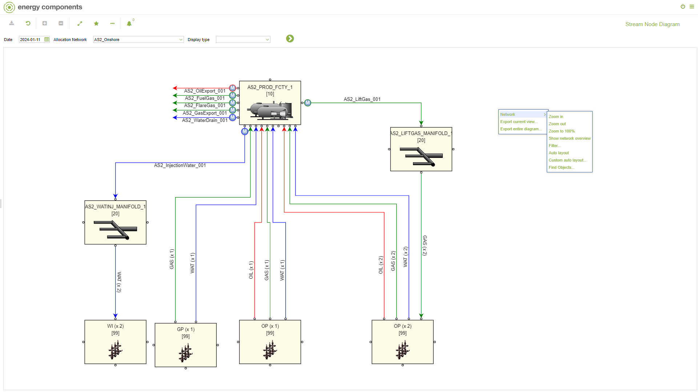
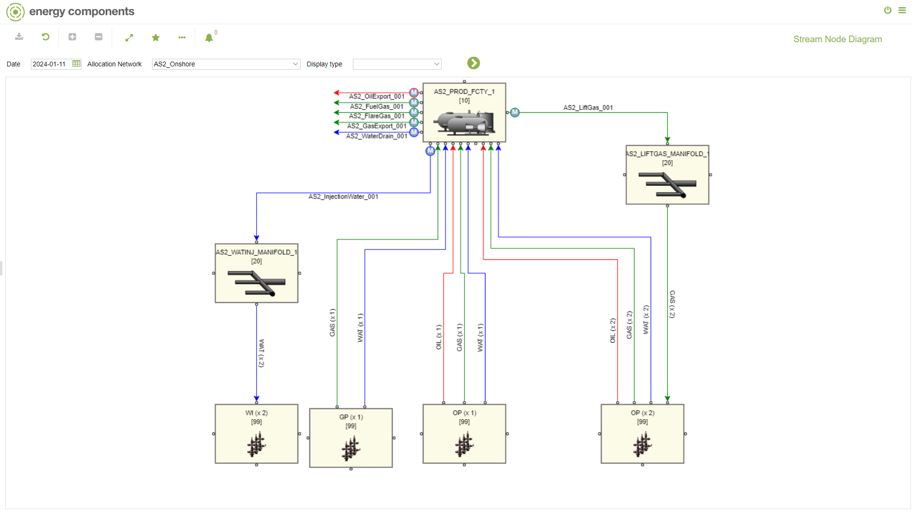
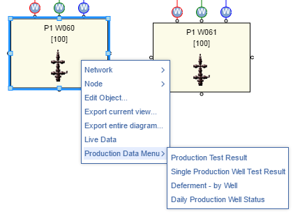
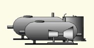
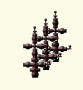
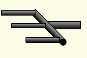
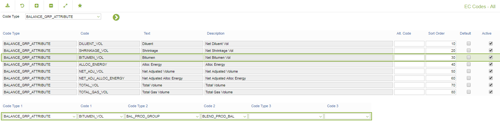

# CO.00941 - Stream Node Diagram

_Deep-dive 2026-07-02 (deterministic runner). Module: CO._

## Identity
- BF_CODE: CO.00941 - URL: `/com.ec.prod.co.screens.snd/stream_node_diagram/OBJ_CLASS/ALLOC_NETWORK/DATA_CLASS/ALLOC_NETWORK_LIST`

## DB binding (metadata-resolved)
| Class | Type/Scope | Base table | View |
|---|---|---|---|
| `ALLOC_NETWORK_LIST` | DATA/EVENT | `CALC_COLLECTION_ELEMENT` | `DV_ALLOC_NETWORK_LIST` |

_Resolved by: url path token_

## Screen type
DATA/EVENT

## Help (screen screenshot -- local online-help corpus 14.2.5)

## Help (field-description images -- local online-help corpus 14.2.5)

