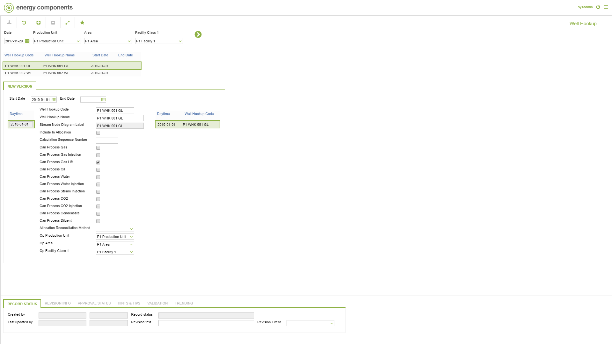
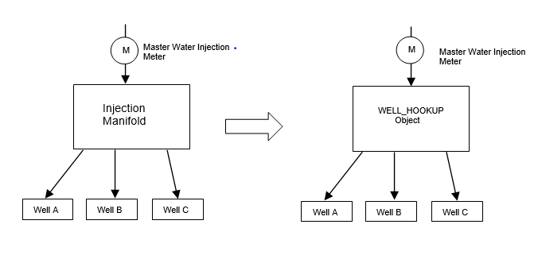

# CO.0108 - Well Hookup

_Deep-dive 2026-07-02 (deterministic runner). Module: CO._

## Identity
- BF_CODE: CO.0108 - URL: `/com.ec.frmw.co.screens/manage_object_groupmodel_nav/GROUPMODEL/WELL_HOOKUP/TARGET/WELL_HOOKUP/CLASS_NAME/WELL_HOOKUP`

## DB binding (metadata-resolved)
| Class | Type/Scope | Base table | View |
|---|---|---|---|
| `WELL_HOOKUP` | OBJECT/VERSIONED | `WELL_HOOKUP` | `OV_WELL_HOOKUP` |

_Resolved by: url CLASS_NAME_

## Screen type
OV (master-data object)

## Help (screen screenshot -- local online-help corpus 14.2.5)

## Help (field-description images -- local online-help corpus 14.2.5)

