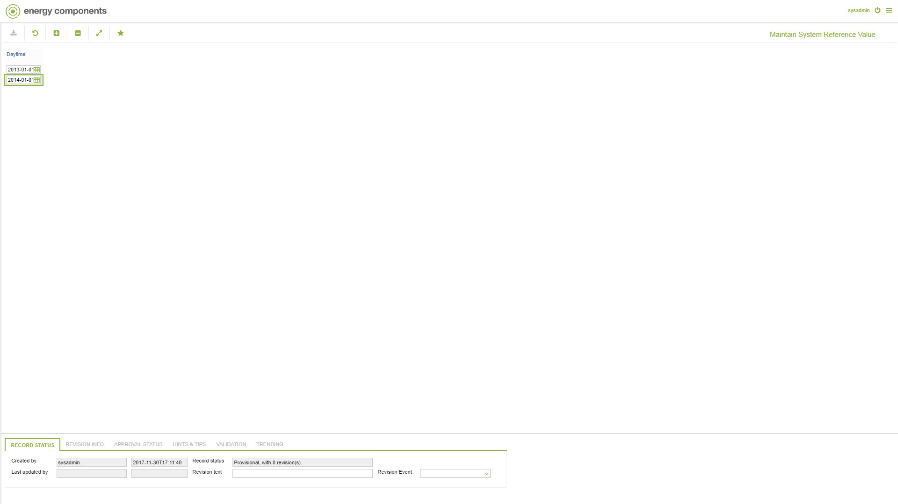

# CO.0151 - Maintain System Reference Value

_Deep-dive 2026-07-04 (deterministic runner). Module: CO._

## Identity
- BF_CODE: CO.0151 - URL: `/com.ec.prod.co.screens/system_ref_value`

## DB binding (metadata-resolved)
| Class | Type/Scope | Base table | View |
|---|---|---|---|
| `SYSTEM_REF_VALUE` | TABLE/EVENT | `SYSTEM_REF_VALUE` | `TV_SYSTEM_REF_VALUE` |

_Resolved by: url path token_

## Screen type
TV (table-class)

## Help (screen screenshot -- local online-help corpus 14.2.5)

## Help (field-description images -- local online-help corpus 14.2.5)
_(no field-description images in corpus for this BF_CODE)_
