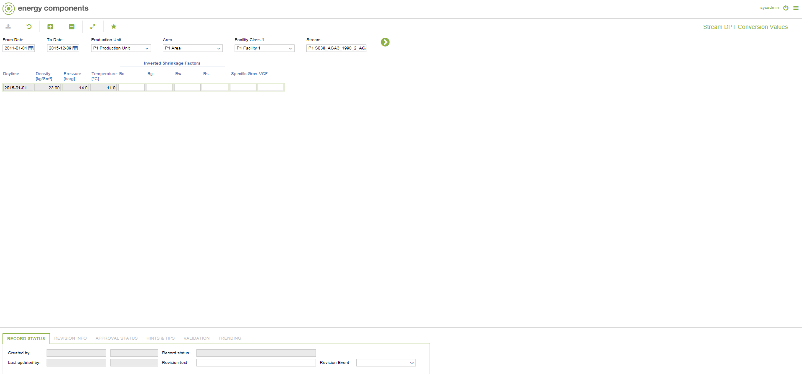

# CO.0187 - Stream DPT Conversion Values

_Deep-dive 2026-07-04 (deterministic runner). Module: CO._

## Identity
- BF_CODE: CO.0187 - URL: `/com.ec.prod.co.screens/stream_dpt_conversion/CLASS_NAME/STRM_DPT_CONVERSION`

## DB binding (metadata-resolved)
| Class | Type/Scope | Base table | View |
|---|---|---|---|
| `STRM_DPT_CONVERSION` | DATA/EVENT | `STRM_DPT_CONVERSION` | `DV_STRM_DPT_CONVERSION` |

_Resolved by: url CLASS_NAME_

## Screen type
DATA/EVENT

## Help (screen screenshot -- local online-help corpus 14.2.5)

## Help (field-description images -- local online-help corpus 14.2.5)
_(no field-description images in corpus for this BF_CODE)_
