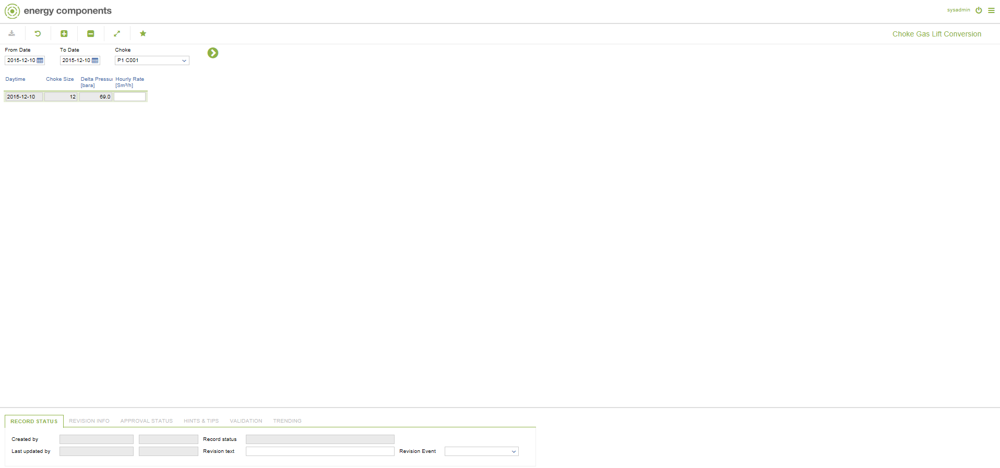

# CO.0189 - Choke Gas Lift Conversion

_Deep-dive 2026-07-04 (deterministic runner). Module: CO._

## Identity
- BF_CODE: CO.0189 - URL: `/com.ec.prod.co.screens/choke_gas_lift_conversion`

## DB binding (metadata-resolved)
| Class | Type/Scope | Base table | View |
|---|---|---|---|
| `CHOKE_GL_CONVERSION` | DATA/EVENT | `CHOKE_GL_CONVERSION` | `DV_CHOKE_GL_CONVERSION` |

_Resolved by: label (exact, unique)_

## Screen type
DATA/EVENT

## Help (screen screenshot -- local online-help corpus 14.2.5)

## Help (field-description images -- local online-help corpus 14.2.5)
_(no field-description images in corpus for this BF_CODE)_
