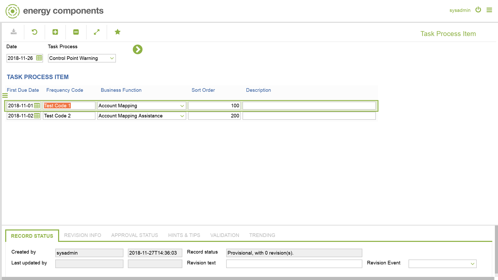

# CO.0192 - Task Process Item

_Deep-dive 2026-07-04 (deterministic runner). Module: CO._

## Identity
- BF_CODE: CO.0192 - URL: `/com.ec.frmw.workflow.screens/task_process_item`

## DB binding (metadata-resolved)
| Class | Type/Scope | Base table | View |
|---|---|---|---|
| `TASK_PROCESS_ITEM` | TABLE/EVENT | `TASK_PROCESS_ITEM` | `TV_TASK_PROCESS_ITEM` |

_Resolved by: url path token_

## Screen type
TV (table-class)

## Help (screen screenshot -- local online-help corpus 14.2.5)

## Help (field-description images -- local online-help corpus 14.2.5)
_(no field-description images in corpus for this BF_CODE)_
