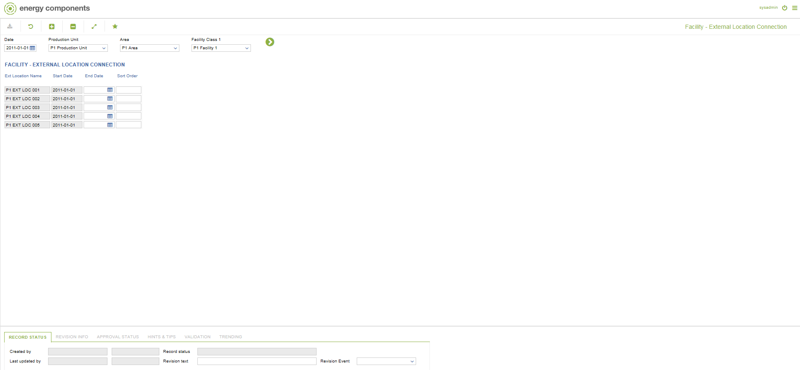

# CO.0228 - Facility - External Location Connection

_Deep-dive 2026-07-04 (deterministic runner). Module: CO._

## Identity
- BF_CODE: CO.0228 - URL: `/com.ec.prod.co.screens/fcty_ext_location_conn`

## DB binding (metadata-resolved)
| Class | Type/Scope | Base table | View |
|---|---|---|---|
| `FCTY_EXT_LOCATION_CONN` | DATA/EVENT | `FCTY_EXT_LOCATION_CONN` | `DV_FCTY_EXT_LOCATION_CONN` |

_Resolved by: url path token_

## Screen type
DATA/EVENT

## Help (screen screenshot -- local online-help corpus 14.2.5)

## Help (field-description images -- local online-help corpus 14.2.5)
_(no field-description images in corpus for this BF_CODE)_
