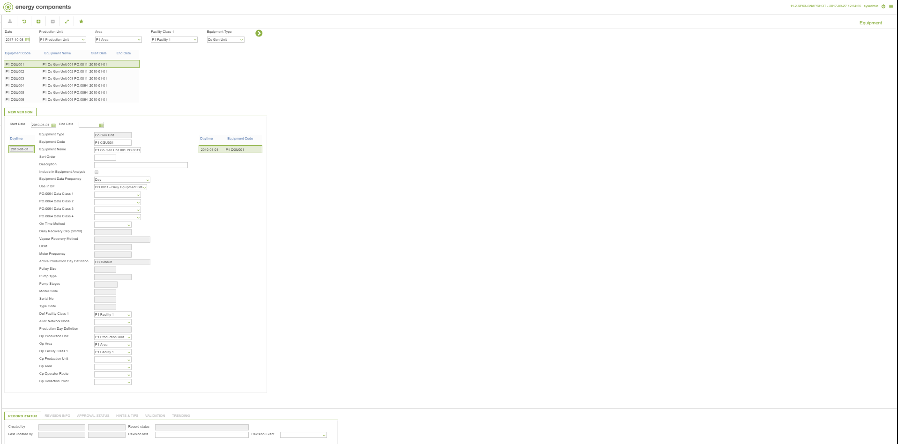

# CO.0237 - Equipment

_Deep-dive 2026-07-04 (deterministic runner). Module: CO._

## Identity
- BF_CODE: CO.0237 - URL: `/com.ec.prod.co.screens/manage_equipment`

## DB binding (metadata-resolved)
| Class | Type/Scope | Base table | View |
|---|---|---|---|
| `EQUIPMENT` | INTERFACE/VERSIONED | `None` | `(none)` |

_Resolved by: url path token_

## Screen type
OV (interface/object screen)

## Help (screen screenshot -- local online-help corpus 14.2.5)

## Help (field-description images -- local online-help corpus 14.2.5)
_(no field-description images in corpus for this BF_CODE)_
