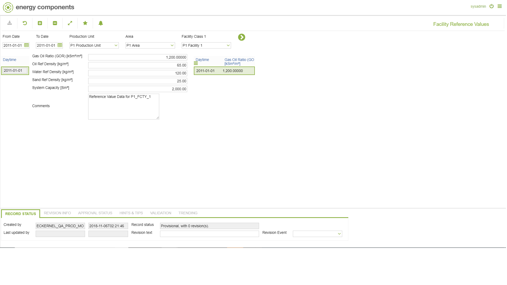

# CO.0248 - Facility Reference Values

_Deep-dive 2026-07-04 (deterministic runner). Module: CO._

## Identity
- BF_CODE: CO.0248 - URL: `/com.ec.prod.co.screens/fcty_reference_value`

## DB binding (metadata-resolved)
| Class | Type/Scope | Base table | View |
|---|---|---|---|
| `FCTY_REFERENCE_VALUE` | DATA/NONE | `FCTY_REFERENCE_VALUE` | `DV_FCTY_REFERENCE_VALUE` |

_Resolved by: url path token_

## Screen type
DATA/NONE

## Help (screen screenshot -- local online-help corpus 14.2.5)

## Help (field-description images -- local online-help corpus 14.2.5)
_(no field-description images in corpus for this BF_CODE)_
