# CO.0250 - Manage Well

_Deep-dive 2026-07-04 (deterministic runner). Module: CO._

## Identity
- BF_CODE: CO.0250 - URL: `/com.ec.prod.co.screens/manage_well_gm_nav/GROUPMODEL/WELL/TARGET/WELL/CLASS_NAME/WELL`

## DB binding (metadata-resolved)
| Class | Type/Scope | Base table | View |
|---|---|---|---|
| `WELL` | OBJECT/VERSIONED | `WELL` | `OV_WELL` |

_Resolved by: url CLASS_NAME_

## Screen type
OV (master-data object)

## Help (screen screenshot -- local online-help corpus 14.2.5)
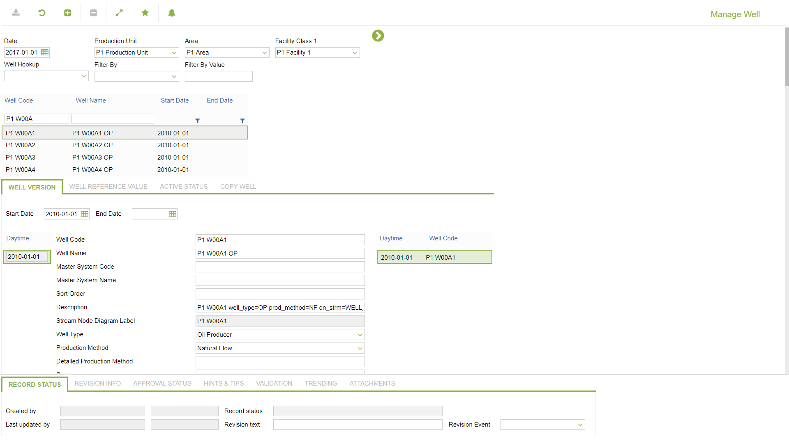
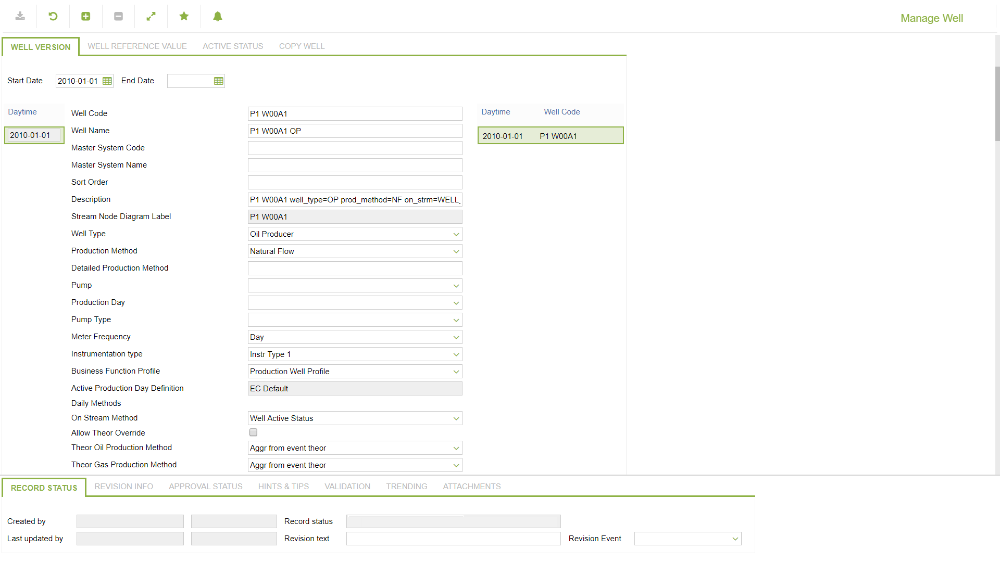
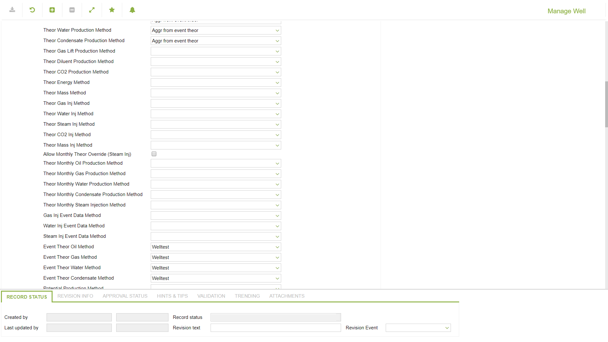
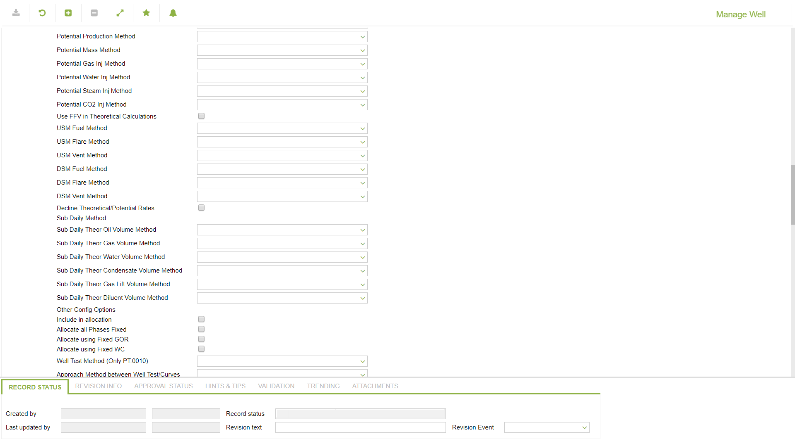
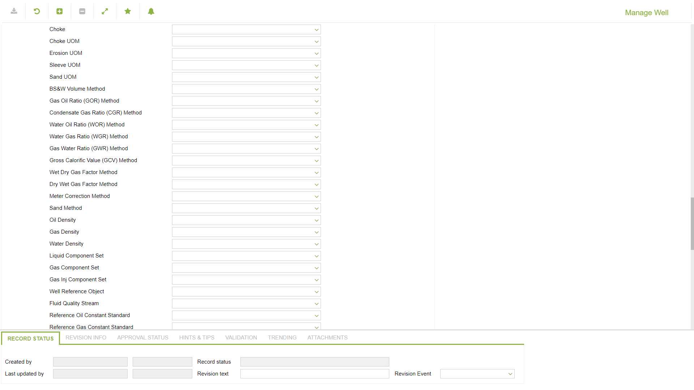
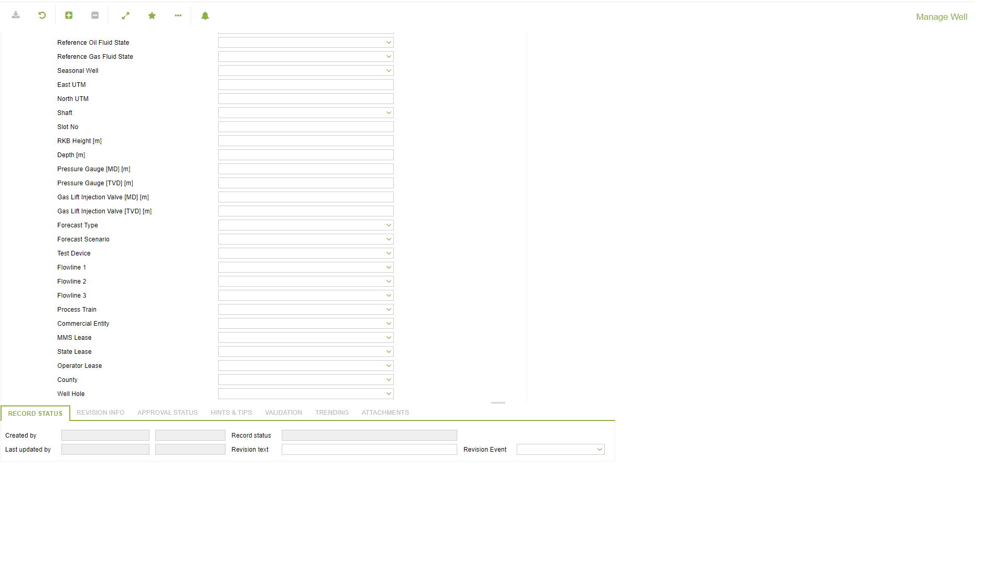
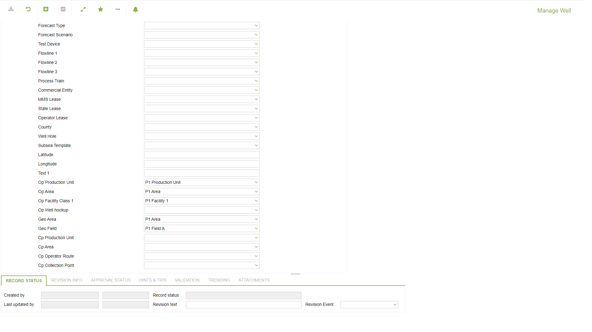
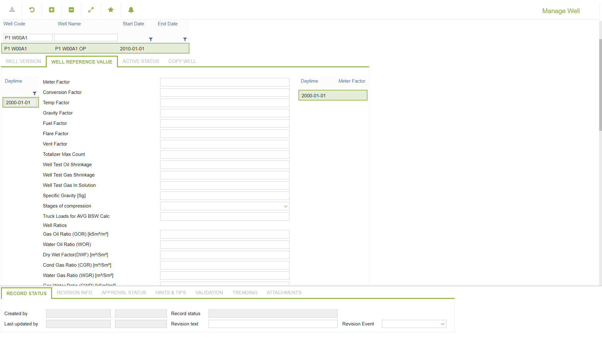
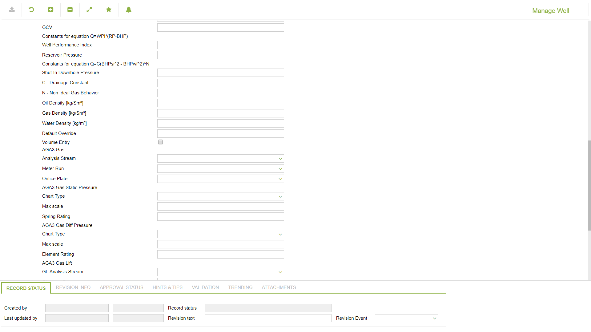
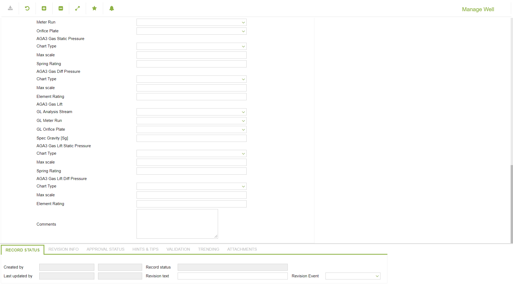
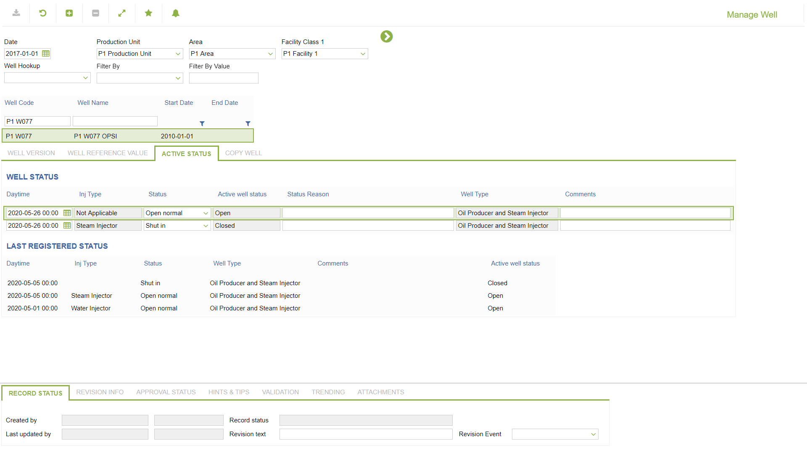
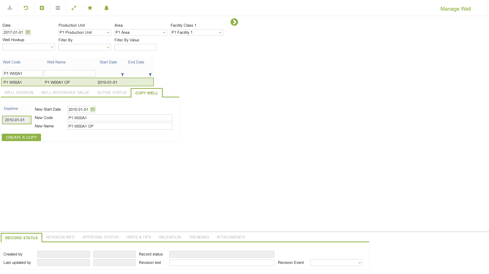

## Help (field-description images -- local online-help corpus 14.2.5)
_(no field-description images in corpus for this BF_CODE)_
