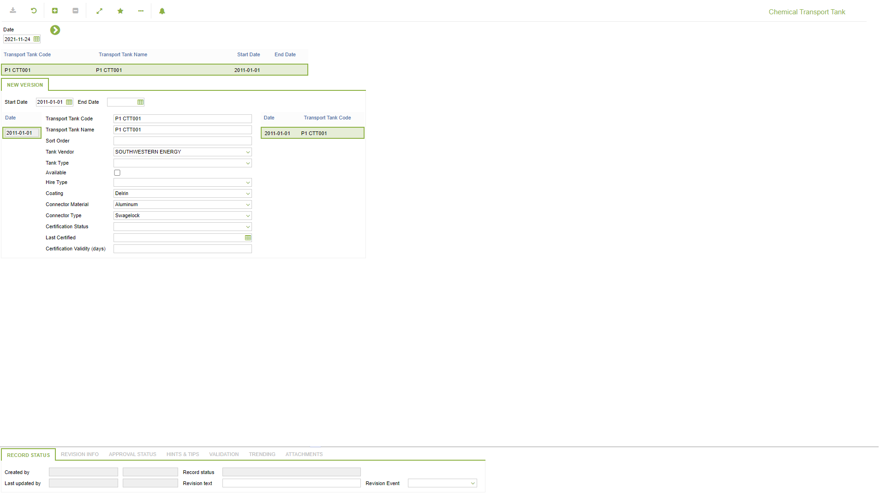

# CO.0257 - Chemical Transport Tank

_Deep-dive 2026-07-04 (deterministic runner). Module: CO._

## Identity
- BF_CODE: CO.0257 - URL: `/com.ec.frmw.co.screens/manage_object_nav/CLASS_NAME/CHEM_TRANS_TANK`

## DB binding (metadata-resolved)
| Class | Type/Scope | Base table | View |
|---|---|---|---|
| `CHEM_TRANS_TANK` | OBJECT/VERSIONED | `CHEM_TRANS_TANK` | `OV_CHEM_TRANS_TANK` |

_Resolved by: url CLASS_NAME_

## Screen type
OV (master-data object)

## Help (screen screenshot -- local online-help corpus 14.2.5)

## Help (field-description images -- local online-help corpus 14.2.5)
_(no field-description images in corpus for this BF_CODE)_
