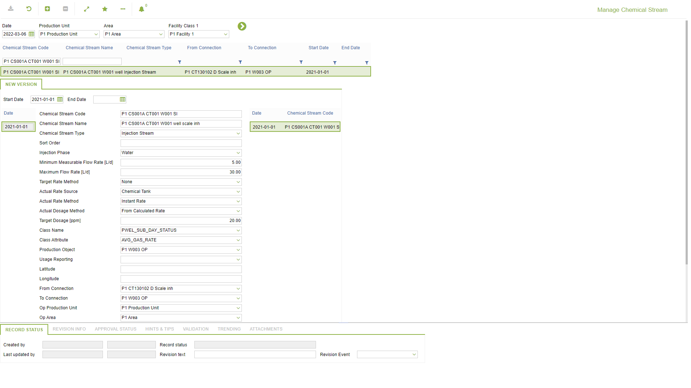
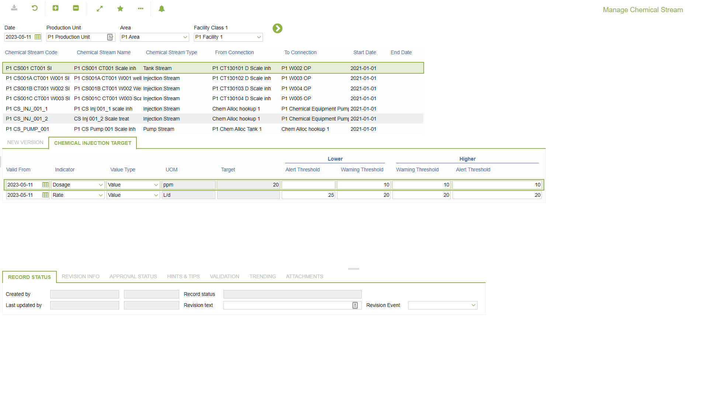
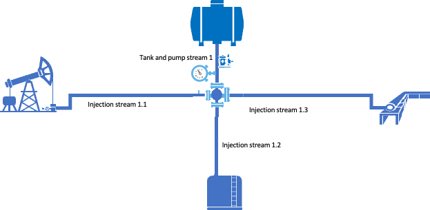
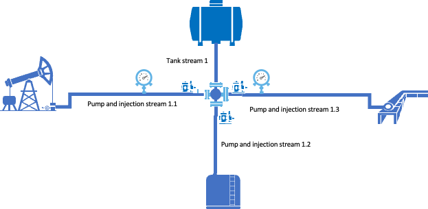
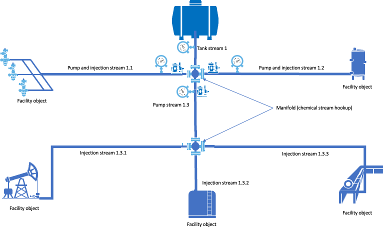
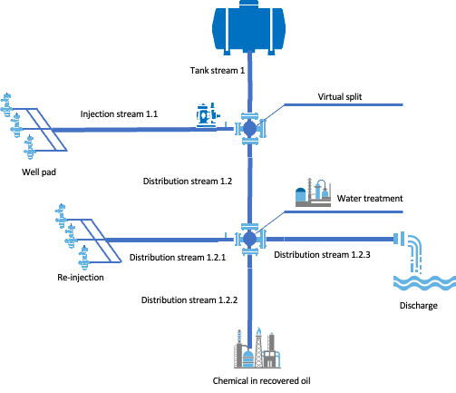
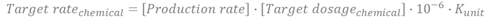
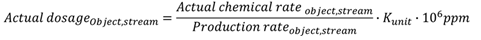

# CO.0263 - Manage Chemical Stream

_Deep-dive 2026-07-04 (deterministic runner). Module: CO._

## Identity
- BF_CODE: CO.0263 - URL: `/com.ec.chem.co.screens/manage_chem_stream/GROUPMODEL/CHEM_STREAM/TARGET/CHEM_STREAM/CLASS_NAME/CHEM_STREAM`

## DB binding (metadata-resolved)
| Class | Type/Scope | Base table | View |
|---|---|---|---|
| `CHEM_STREAM` | OBJECT/VERSIONED | `CHEM_STREAM` | `OV_CHEM_STREAM` |

_Resolved by: url CLASS_NAME_

## Screen type
OV (master-data object)

## Help (screen screenshot -- local online-help corpus 14.2.5)

## Help (field-description images -- local online-help corpus 14.2.5)

