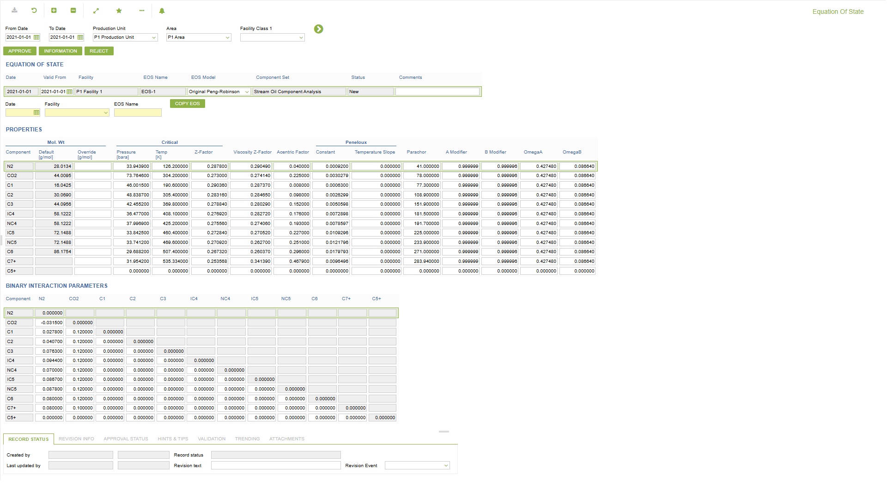

# CO.0267 - Equation Of State

_Deep-dive 2026-07-04 (deterministic runner). Module: CO._

## Identity
- BF_CODE: CO.0267 - URL: `/com.ec.prod.co.screens/equation_of_state/CLASS_NAME/EOS_CONFIG/CLASS_NAME_1/EOS_COMP_PROPERTY`

## DB binding (metadata-resolved)
| Class | Type/Scope | Base table | View |
|---|---|---|---|
| `EOS_CONFIG` | DATA/EVENT | `EOS_CONFIG` | `DV_EOS_CONFIG` |
| `EOS_COMP_PROPERTY` | TABLE/EVENT | `EOS_COMP_PROPERTY` | `TV_EOS_COMP_PROPERTY` |

_Resolved by: url CLASS_NAME_

## Screen type
DATA/EVENT

## Help (screen screenshot -- local online-help corpus 14.2.5)

## Help (field-description images -- local online-help corpus 14.2.5)
_(no field-description images in corpus for this BF_CODE)_
