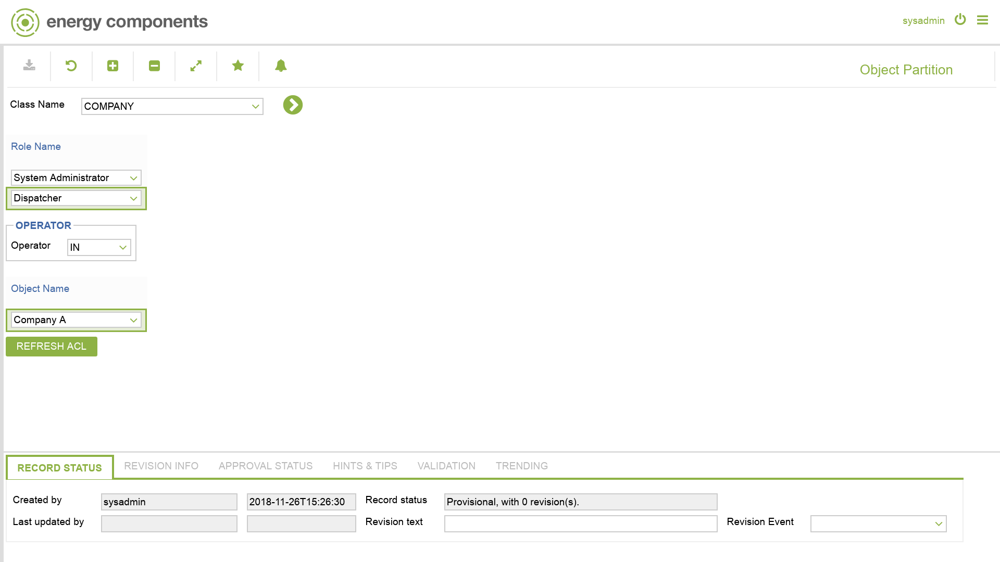

# CO.1004 - Object Partition

_Deep-dive 2026-07-05 (deterministic runner). Module: CO._

## Identity
- BF_CODE: CO.1004 - URL: `/com.ec.frmw.co.screens/maintain_access_partitions`

## DB binding (metadata-resolved)
| Class | Type/Scope | Base table | View |
|---|---|---|---|
| `T_BASIS_OBJECT_PARTITION` | TABLE/EVENT | `T_BASIS_OBJECT_PARTITION` | `TV_T_BASIS_OBJECT_PARTITION` |

_Resolved by: label (exact, unique)_

## Screen type
TV (table-class)

## Help (screen screenshot -- local online-help corpus 14.2.5)

## Help (field-description images -- local online-help corpus 14.2.5)
_(no field-description images in corpus for this BF_CODE)_
