# CO.1040 - Maintain Calculation

_Deep-dive 2026-07-05 (deterministic runner). Module: CO._

## Identity
- BF_CODE: CO.1040 - URL: `/com.ec.frmw.bs.calc.screens/maintain_calculation`

## DB binding (metadata-resolved)
| Class | Type/Scope | Base table | View |
|---|---|---|---|
| `CALCULATION` | OBJECT/VERSIONED | `CALCULATION` | `OV_CALCULATION` |

_Resolved by: url path token_

## Screen type
OV (master-data object)

## Help (screen screenshot -- local online-help corpus 14.2.5)
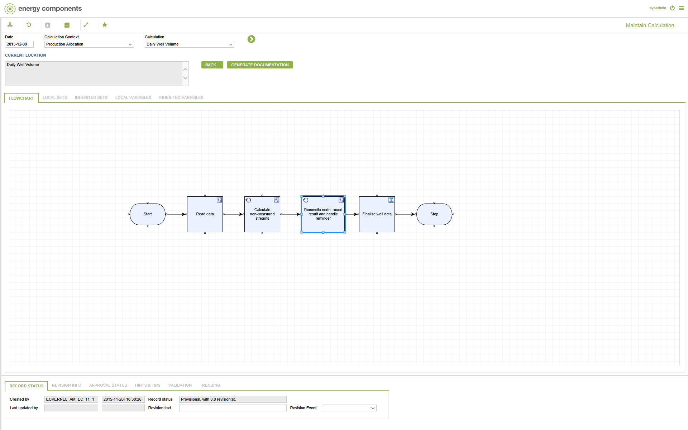
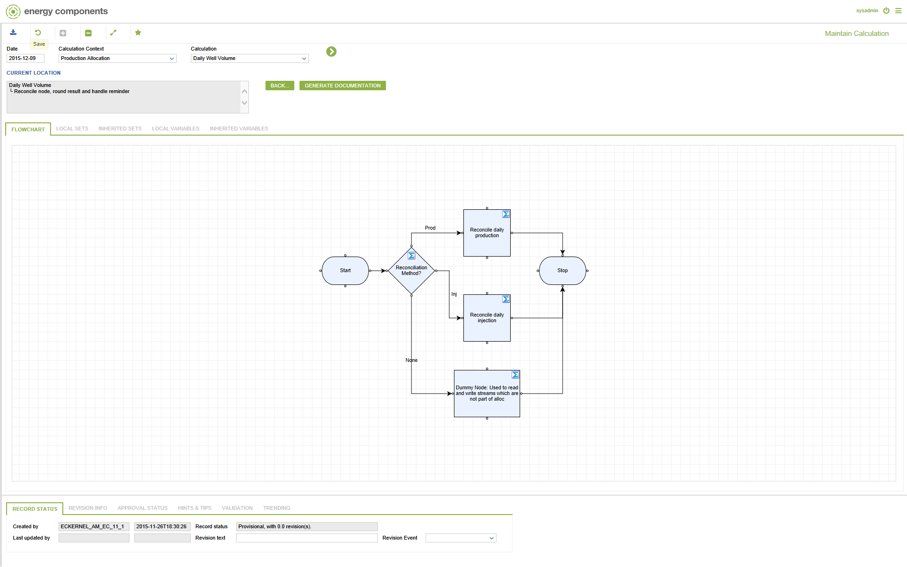
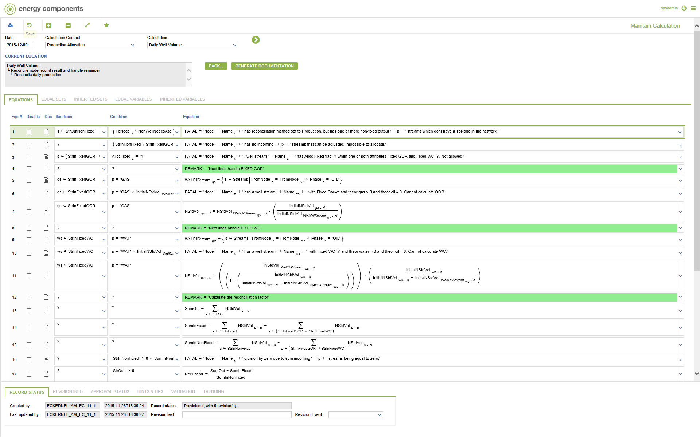
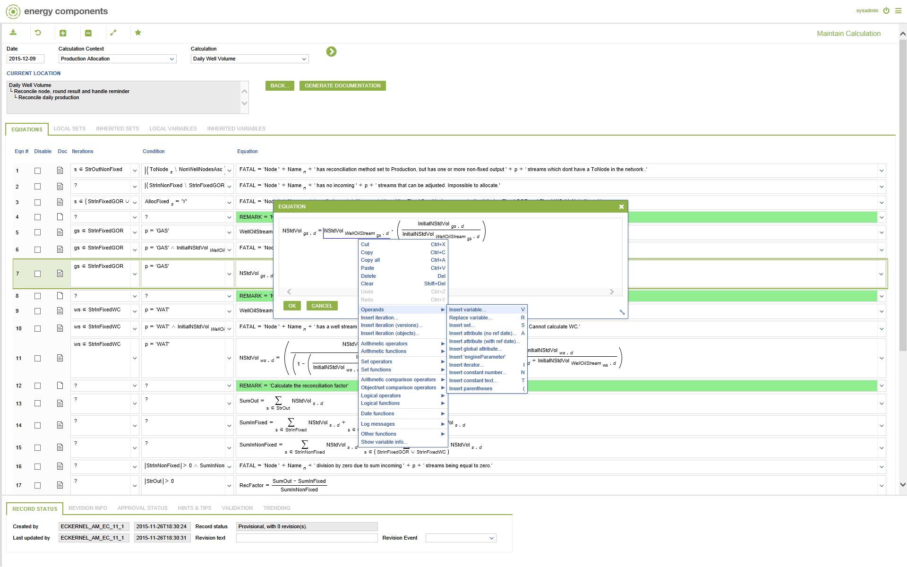
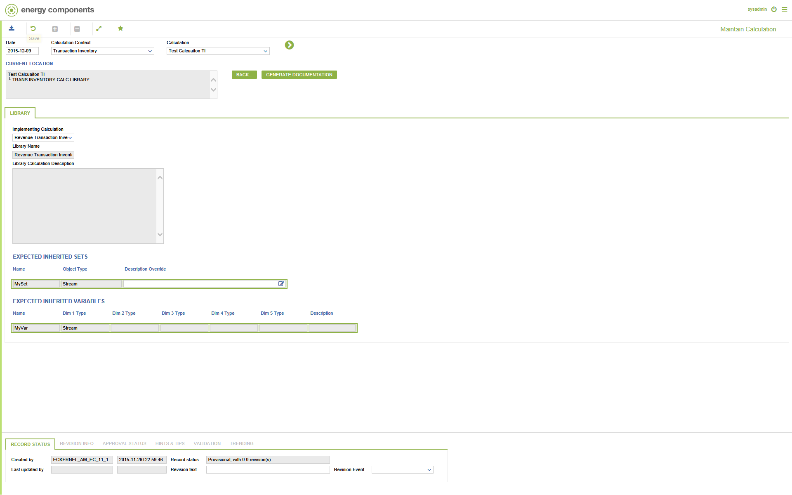
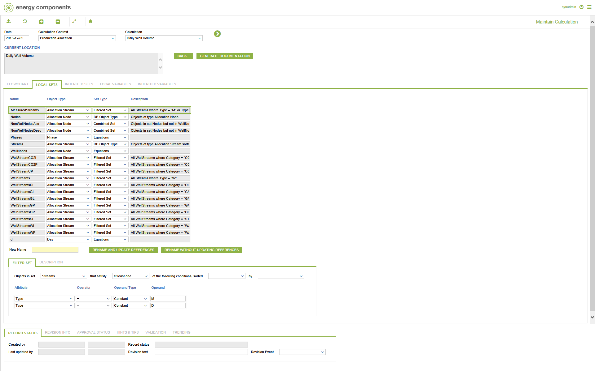
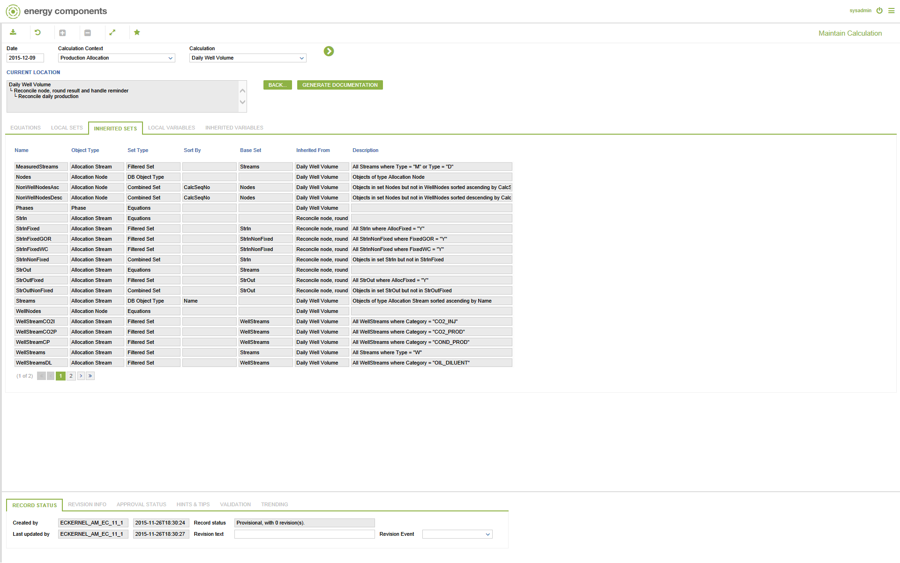
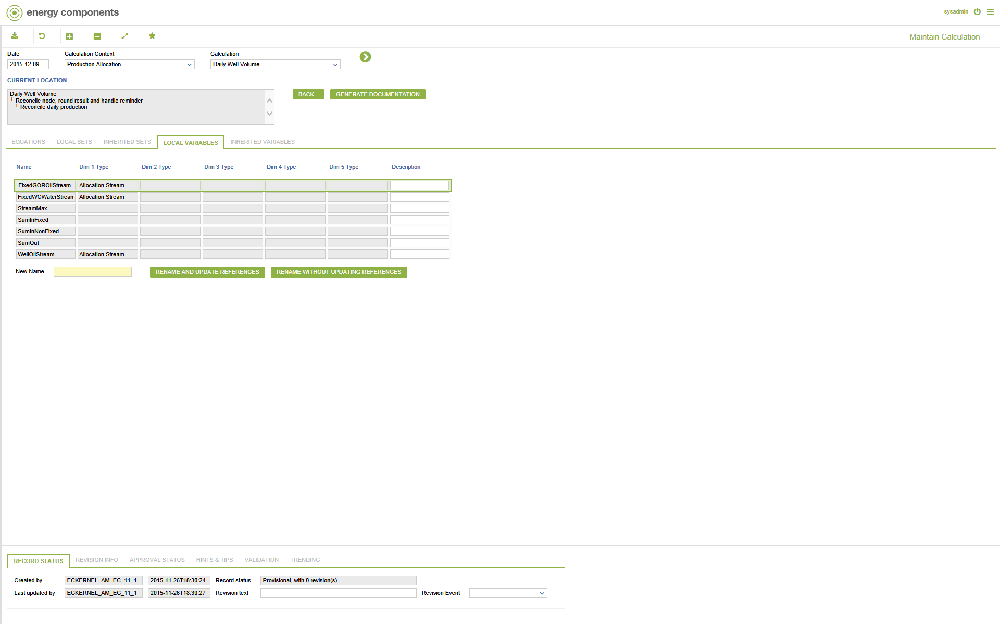
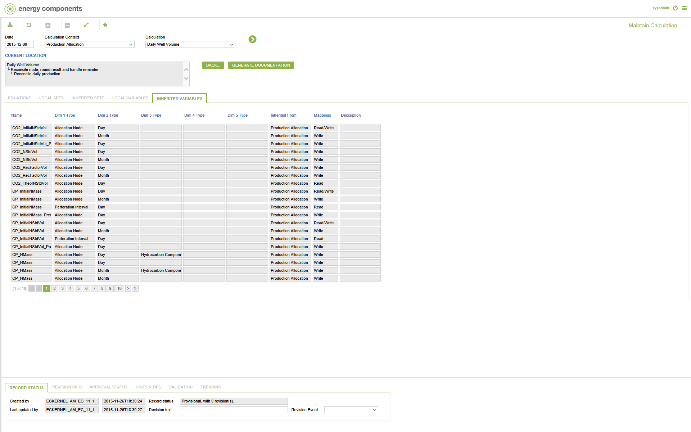

## Help (field-description images -- local online-help corpus 14.2.5)
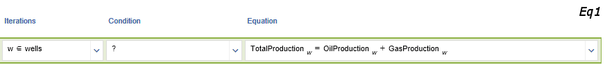
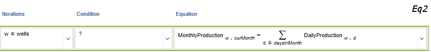
