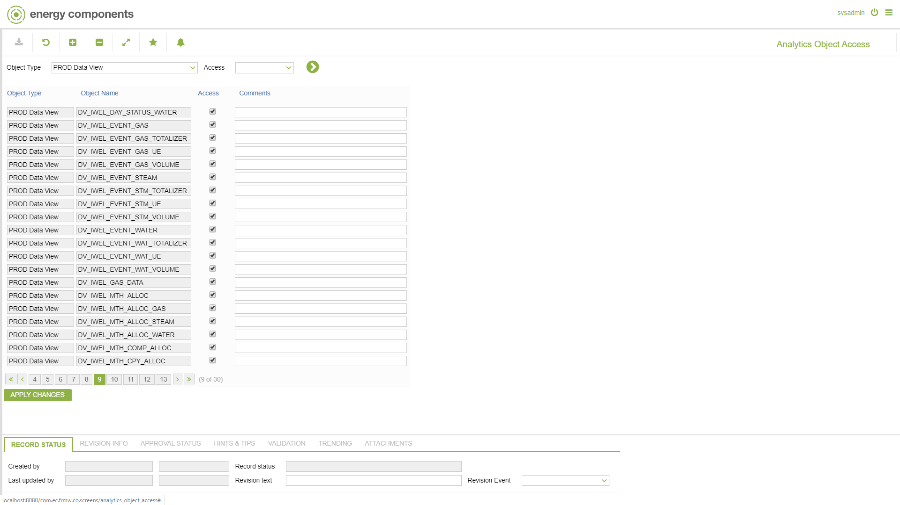
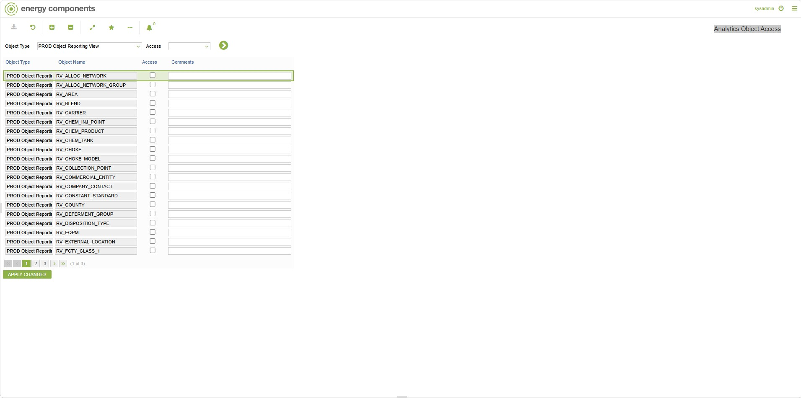

# CO.1078 - Analytics Object Access

_Deep-dive 2026-07-05 (deterministic runner). Module: CO._

## Identity
- BF_CODE: CO.1078 - URL: `/com.ec.frmw.co.screens/analytics_object_access`

## DB binding (metadata-resolved)
| Class | Type/Scope | Base table | View |
|---|---|---|---|
| `CTRL_ANALYTICS_ACCESS` | TABLE/EVENT | `CTRL_ANALYTICS_ACCESS` | `TV_CTRL_ANALYTICS_ACCESS` |

_Resolved by: label (exact, unique)_

## Screen type
TV (table-class)

## Help (screen screenshot -- local online-help corpus 14.2.5)

## Help (field-description images -- local online-help corpus 14.2.5)
_(no field-description images in corpus for this BF_CODE)_

## Live sandbox capture (2026-08-11/12, local sandbox -- real data, not the online-help corpus)

