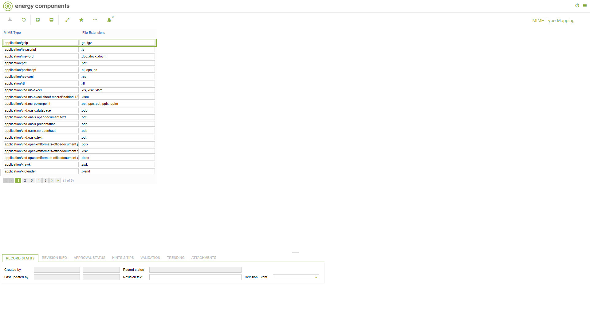

# CO.1092 - MIME Type Mapping

_Deep-dive 2026-07-05 (deterministic runner). Module: CO._

## Identity
- BF_CODE: CO.1092 - URL: `/com.ec.frmw.co.screens/maintain_mime_type_mapping`

## DB binding (metadata-resolved)
| Class | Type/Scope | Base table | View |
|---|---|---|---|
| `CTRL_MIME_TYPE_MAPPING` | TABLE/NONE | `CTRL_MIME_TYPE_MAPPING` | `TV_CTRL_MIME_TYPE_MAPPING` |

_Resolved by: label (exact, unique)_

## Screen type
TV (table-class)

## Help (screen screenshot -- local online-help corpus 14.2.5)

## Help (field-description images -- local online-help corpus 14.2.5)
_(no field-description images in corpus for this BF_CODE)_
