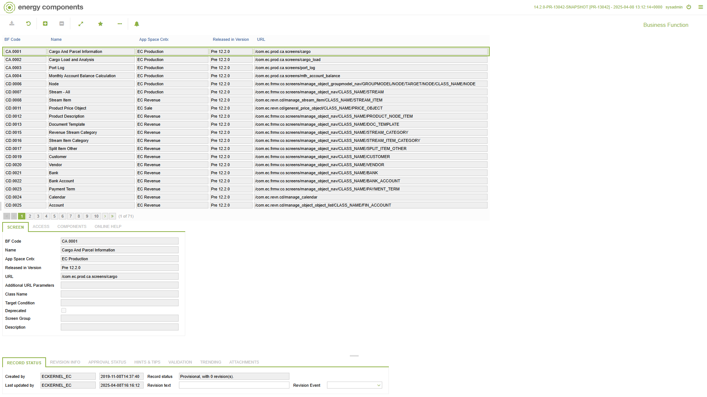
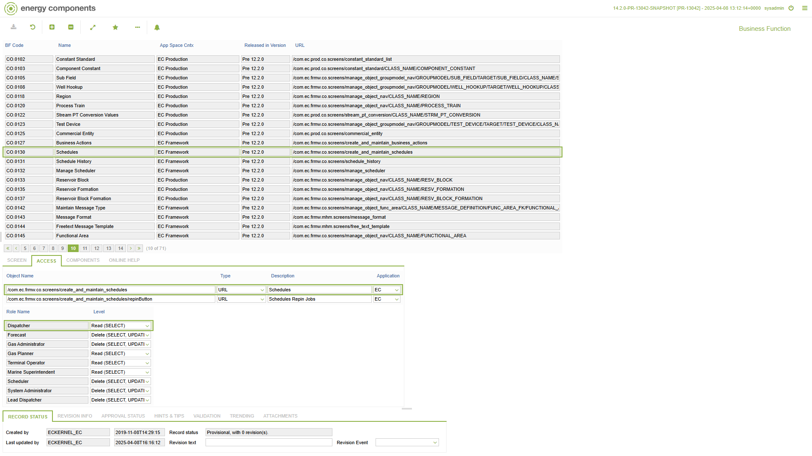
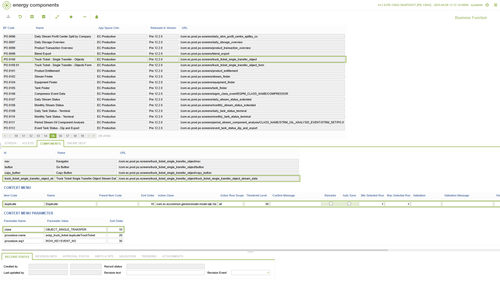
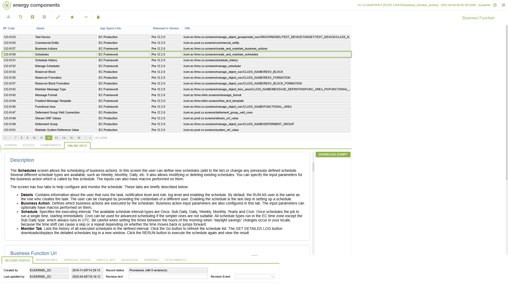

# CO.1097 - Business Function

_Deep-dive 2026-07-05 (deterministic runner). Module: CO._

## Identity
- BF_CODE: CO.1097 - URL: `/com.ec.frmw.co.screens/business_function`

## DB binding (metadata-resolved)
| Class | Type/Scope | Base table | View |
|---|---|---|---|
| `BUSINESS_FUNCTION` | TABLE/NONE | `BUSINESS_FUNCTION` | `TV_BUSINESS_FUNCTION` |

_Resolved by: url path token_

## Screen type
TV (table-class)

## Help (screen screenshot -- local online-help corpus 14.2.5)

## Help (field-description images -- local online-help corpus 14.2.5)
_(no field-description images in corpus for this BF_CODE)_
