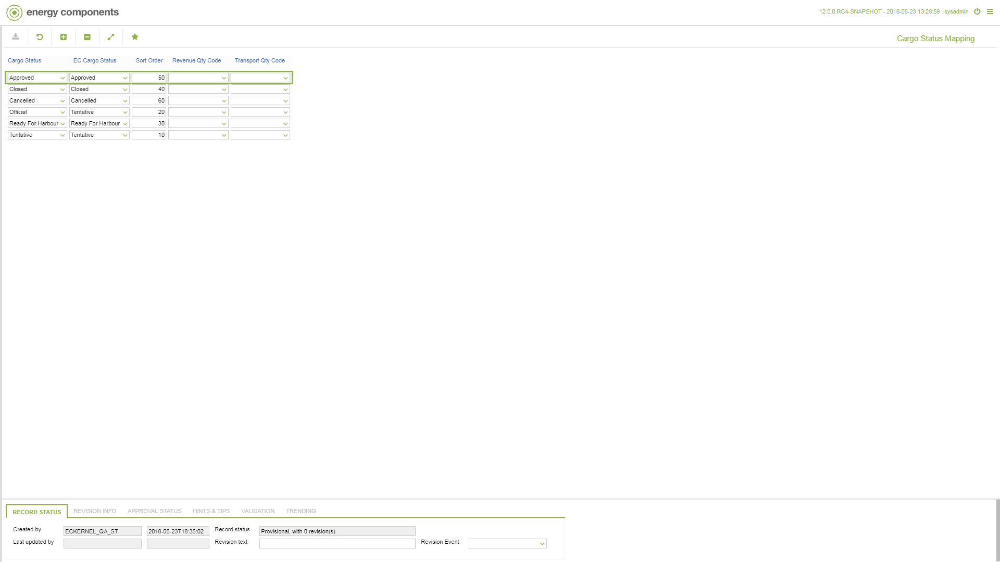

# CO.2006 - Cargo Status Mapping

_Deep-dive 2026-07-05 (deterministic runner). Module: CO._

## Identity
- BF_CODE: CO.2006 - URL: `/com.ec.frmw.co.screens/manage_table/CLASS_NAME/CARGO_STATUS_MAPPING`

## DB binding (metadata-resolved)
| Class | Type/Scope | Base table | View |
|---|---|---|---|
| `CARGO_STATUS_MAPPING` | TABLE/EVENT | `CARGO_STATUS_MAPPING` | `TV_CARGO_STATUS_MAPPING` |

_Resolved by: url CLASS_NAME_

## Screen type
TV (table-class)

## Help (screen screenshot -- local online-help corpus 14.2.5)

## Help (field-description images -- local online-help corpus 14.2.5)
_(no field-description images in corpus for this BF_CODE)_
