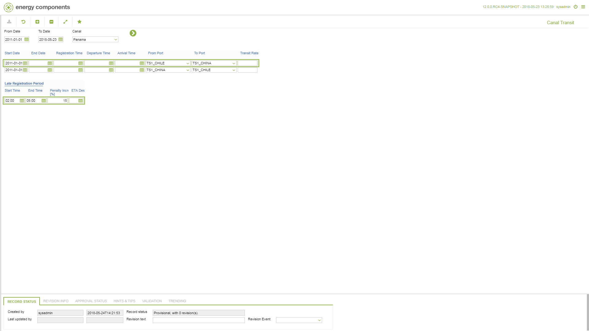

# CO.2070 - Canal Transit

_Deep-dive 2026-07-05 (deterministic runner). Module: CO._

## Identity
- BF_CODE: CO.2070 - URL: `/com.ec.tran.co.screens/canal_transit`

## DB binding (metadata-resolved)
| Class | Type/Scope | Base table | View |
|---|---|---|---|
| `CANAL_TRANSIT` | DATA/DAY | `CANAL_TRANSIT` | `DV_CANAL_TRANSIT` |

_Resolved by: url path token_

## Screen type
N1 daily-status grid

## Help (screen screenshot -- local online-help corpus 14.2.5)

## Help (field-description images -- local online-help corpus 14.2.5)
_(no field-description images in corpus for this BF_CODE)_
