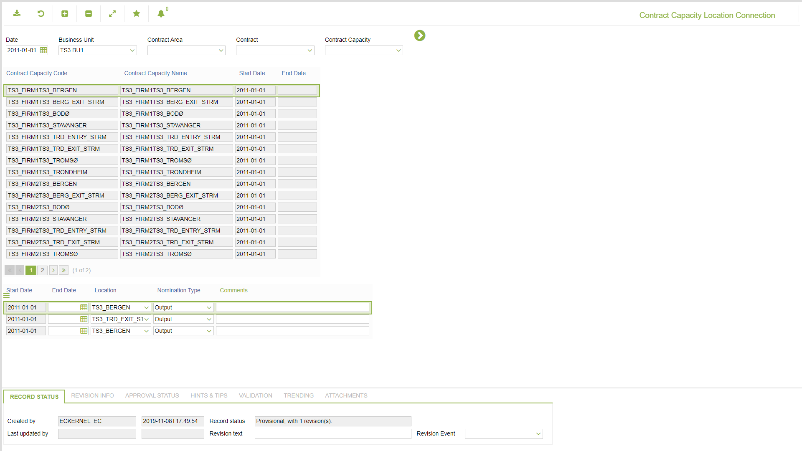

# CO.2073 - Contract Capacity Location Connection

_Deep-dive 2026-07-05 (deterministic runner). Module: CO._

## Identity
- BF_CODE: CO.2073 - URL: `/com.ec.tran.co.screens/object_connection/TARGET/CONTRACT_CAPACITY/CLASS_LIST/CNTR_CAPACITY_LIST/CLASS/CNTR_CAP_LOC_CONNECTION`

## DB binding (metadata-resolved)
| Class | Type/Scope | Base table | View |
|---|---|---|---|
| `CNTR_CAP_LOC_CONNECTION` | DATA/DAY | `CNTR_CAP_LOC_CONNECTION` | `DV_CNTR_CAP_LOC_CONNECTION` |

_Resolved by: url path token_

## Screen type
N1 daily-status grid

## Help (screen screenshot -- local online-help corpus 14.2.5)

## Help (field-description images -- local online-help corpus 14.2.5)
_(no field-description images in corpus for this BF_CODE)_
