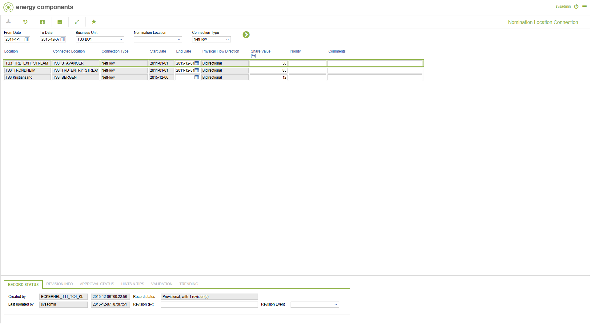

# CO.2076 - Nomination Location Connection

_Deep-dive 2026-07-05 (deterministic runner). Module: CO._

## Identity
- BF_CODE: CO.2076 - URL: `/com.ec.tran.co.screens/nomination_location_connection/NAV_MODEL/TRAN_OPERATIONAL/TARGET/NOMINATION_LOCATION/BF_PROFILE/CO.2076/CLASS/NOMLOC_CONNECTION/TRAN_NOMLOC_CONN/NETFLOW/TRAN_NOMLOC_CONN_POPUP/NetFlow`

## DB binding (metadata-resolved)
| Class | Type/Scope | Base table | View |
|---|---|---|---|
| `NOMLOC_CONNECTION` | DATA/EVENT | `OBJLOC_CODE_CONNECTION` | `DV_NOMLOC_CONNECTION` |

_Resolved by: label (exact, unique)_

## Screen type
DATA/EVENT

## Help (screen screenshot -- local online-help corpus 14.2.5)

## Help (field-description images -- local online-help corpus 14.2.5)
_(no field-description images in corpus for this BF_CODE)_
