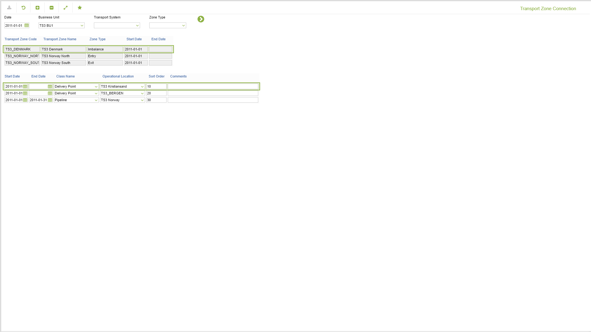

# CO.2085 - Transport Zone Connection

_Deep-dive 2026-07-05 (deterministic runner). Module: CO._

## Identity
- BF_CODE: CO.2085 - URL: `/com.ec.tran.co.screens/transport_zone_connection/NAV_MODEL/TRAN_OPERATIONAL/TARGET/TRANSPORT_SYSTEM`

## DB binding (metadata-resolved)
| Class | Type/Scope | Base table | View |
|---|---|---|---|
| `TRANSPORT_SYSTEM` | OBJECT/VERSIONED | `TRANSPORT_SYSTEM` | `OV_TRANSPORT_SYSTEM` |

_Resolved by: url path token_

## Screen type
OV (master-data object)

## Help (screen screenshot -- local online-help corpus 14.2.5)

## Help (field-description images -- local online-help corpus 14.2.5)
_(no field-description images in corpus for this BF_CODE)_
