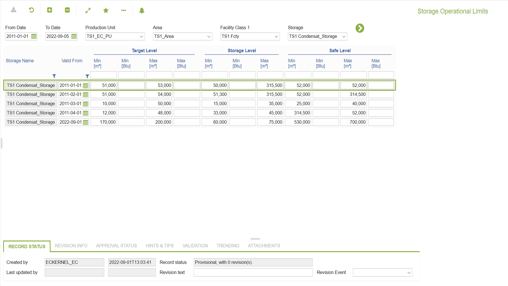

# CO.2093 - Storage Operational Limits

_Deep-dive 2026-07-05 (deterministic runner). Module: CO._

## Identity
- BF_CODE: CO.2093 - URL: `/com.ec.tran.co.screens/storage_operational_limits`

## DB binding (metadata-resolved)
| Class | Type/Scope | Base table | View |
|---|---|---|---|
| `STOR_LIM_DATA` | DATA/EVENT | `STOR_LIM_DATA` | `DV_STOR_LIM_DATA` |

_Resolved by: label (exact, unique)_

## Screen type
DATA/EVENT

## Help (screen screenshot -- local online-help corpus 14.2.5)

## Help (field-description images -- local online-help corpus 14.2.5)
_(no field-description images in corpus for this BF_CODE)_
