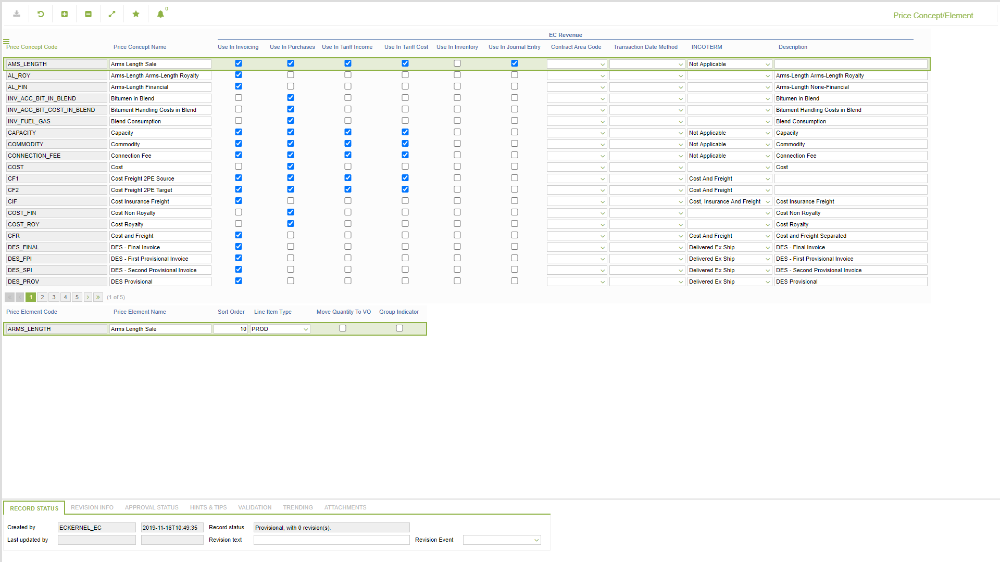

# CO.3015 - Price Concept/Element

_Deep-dive 2026-07-05 (deterministic runner). Module: CO._

## Identity
- BF_CODE: CO.3015 - URL: `/com.ec.sale.co.screens/price_element`

## DB binding (metadata-resolved)
| Class | Type/Scope | Base table | View |
|---|---|---|---|
| `PRICE_ELEMENT` | TABLE/EVENT | `PRICE_CONCEPT_ELEMENT` | `TV_PRICE_ELEMENT` |

_Resolved by: url path token_

## Screen type
TV (table-class)

## Help (screen screenshot -- local online-help corpus 14.2.5)

## Help (field-description images -- local online-help corpus 14.2.5)
_(no field-description images in corpus for this BF_CODE)_
