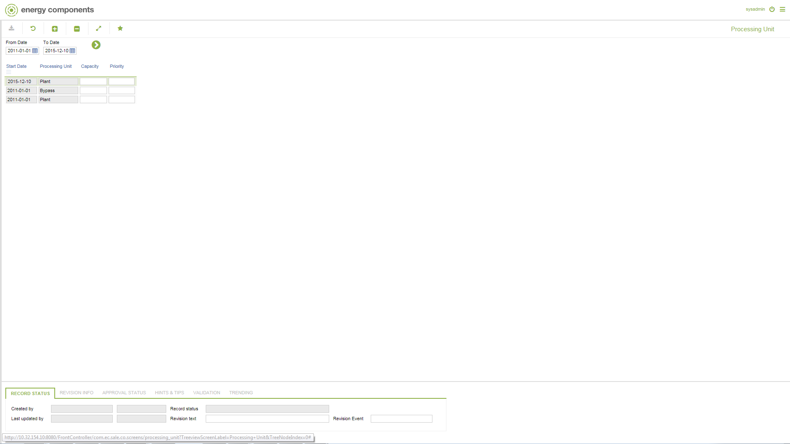

# CO.3019 - Processing Unit

_Deep-dive 2026-07-05 (deterministic runner). Module: CO._

## Identity
- BF_CODE: CO.3019 - URL: `/com.ec.sale.co.screens/processing_unit`

## DB binding (metadata-resolved)
| Class | Type/Scope | Base table | View |
|---|---|---|---|
| `DISP_PROCESSING_UNIT` | TABLE/EVENT | `DISP_PROCESSING_UNIT` | `TV_DISP_PROCESSING_UNIT` |

_Resolved by: label (exact, unique)_

## Screen type
TV (table-class)

## Help (screen screenshot -- local online-help corpus 14.2.5)

## Help (field-description images -- local online-help corpus 14.2.5)
_(no field-description images in corpus for this BF_CODE)_
