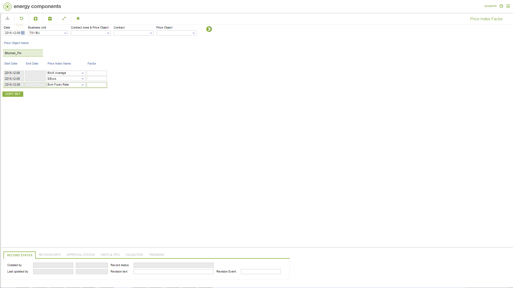

# CO.3020 - Price Index Factor

_Deep-dive 2026-07-05 (deterministic runner). Module: CO._

## Identity
- BF_CODE: CO.3020 - URL: `/com.ec.sale.co.screens/price_index_factor/CLASS/PRICE_INDEX_FACTOR/NAV_MODEL/FINANCIAL/TARGET/PRICE_OBJECT/TARGET_TYPE/self`

## DB binding (metadata-resolved)
| Class | Type/Scope | Base table | View |
|---|---|---|---|
| `PRICE_INDEX_FACTOR` | DATA/EVENT | `PRODUCT_PRICE_INDEX_FACT` | `DV_PRICE_INDEX_FACTOR` |

_Resolved by: label (exact, unique)_

## Screen type
DATA/EVENT

## Help (screen screenshot -- local online-help corpus 14.2.5)

## Help (field-description images -- local online-help corpus 14.2.5)
_(no field-description images in corpus for this BF_CODE)_
