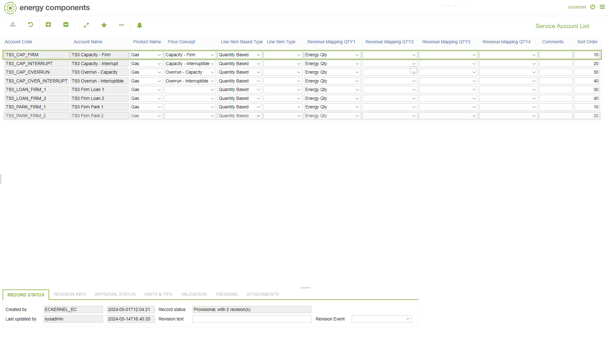

# CO.3027 - Service Account List

_Deep-dive 2026-07-05 (deterministic runner). Module: CO._

## Identity
- BF_CODE: CO.3027 - URL: `/com.ec.sale.co.screens/account_list/ACCOUNT_OBJECT_TYPE/SERVICE`

## DB binding (metadata-resolved)
| Class | Type/Scope | Base table | View |
|---|---|---|---|
| `SERVICE` | OBJECT/VERSIONED | `SERVICE` | `OV_SERVICE` |

_Resolved by: url path token_

## Screen type
OV (master-data object)

## Help (screen screenshot -- local online-help corpus 14.2.5)

## Help (field-description images -- local online-help corpus 14.2.5)
_(no field-description images in corpus for this BF_CODE)_
