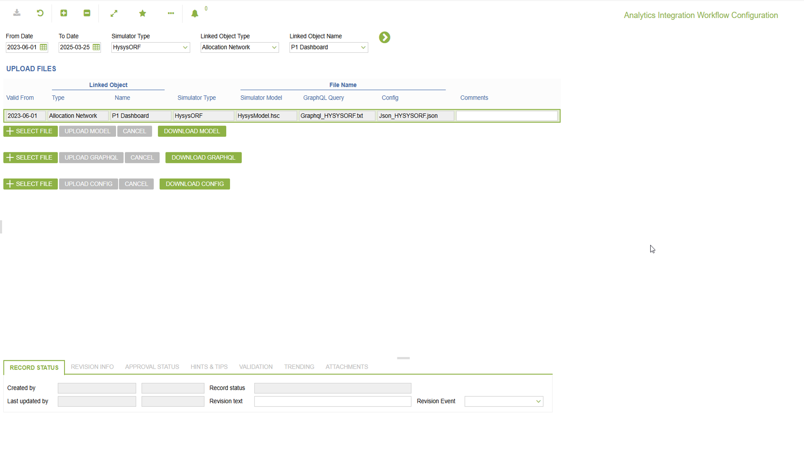

# CO.3031 - Analytics Integration Workflow Configuration

_Deep-dive 2026-07-05 (deterministic runner). Module: CO._

## Identity
- BF_CODE: CO.3031 - URL: `/com.ec.prod.co.screens/simulator_model_upload/CLASS_NAME/SIMULATOR_MODEL_CONFIG`

## DB binding (metadata-resolved)
| Class | Type/Scope | Base table | View |
|---|---|---|---|
| `SIMULATOR_MODEL_CONFIG` | TABLE/EVENT | `EC_SIMULATOR_CONFIG` | `TV_SIMULATOR_MODEL_CONFIG` |

_Resolved by: url CLASS_NAME_

## Screen type
TV (table-class)

## Help (screen screenshot -- local online-help corpus 14.2.5)

## Help (field-description images -- local online-help corpus 14.2.5)
_(no field-description images in corpus for this BF_CODE)_
