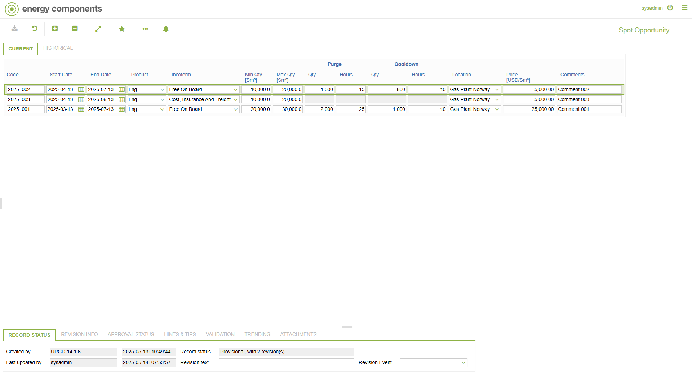
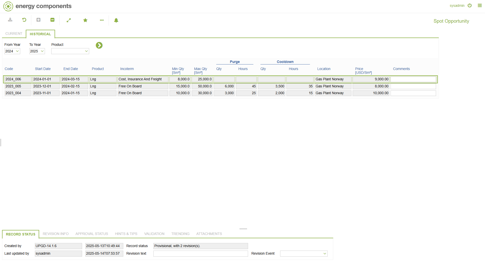

# CO.3050 - Spot Opportunity

_Deep-dive 2026-07-05 (deterministic runner). Module: CO._

## Identity
- BF_CODE: CO.3050 - URL: `/com.ec.tran.co.screens/spot_opportunity`

## DB binding (metadata-resolved)
| Class | Type/Scope | Base table | View |
|---|---|---|---|
| `SPOT_OPPORTUNITY` | TABLE/EVENT | `SPOT_OPPORTUNITY` | `TV_SPOT_OPPORTUNITY` |

_Resolved by: url path token_

## Screen type
TV (table-class)

## Help (screen screenshot -- local online-help corpus 14.2.5)

## Help (field-description images -- local online-help corpus 14.2.5)
_(no field-description images in corpus for this BF_CODE)_
