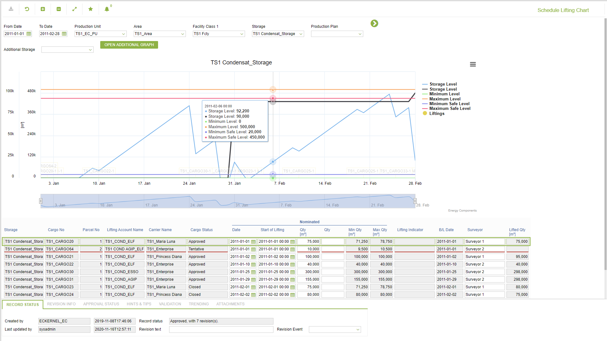
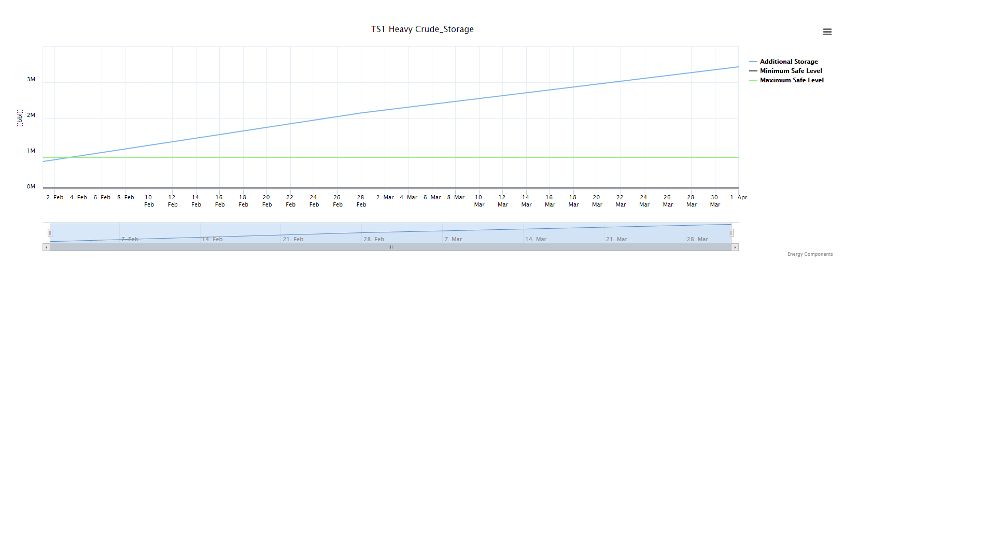

# CP.0002.01 - Schedule Lifting Chart

_Deep-dive 2026-07-06 (deterministic runner). Module: CP._

## Identity
- BF_CODE: CP.0002.01 - URL: `/com.ec.tran.cp.screens/schedule_lifting_jsf/CLASS1/STOR_DAY_BALANCE_GRAPH/CLASS2/STOR_BERTH_DAY_RESTR/CLASS3/STORAGE_LIFT_NOM_SCHED`

## DB binding (metadata-resolved)
| Class | Type/Scope | Base table | View |
|---|---|---|---|
| `STORAGE_LIFT_NOM_SCHED` | DATA/EVENT | `STORAGE_LIFT_NOMINATION` | `DV_STORAGE_LIFT_NOM_SCHED` |

_Resolved by: url path token_

## Screen type
DATA/EVENT

## Help (screen screenshot -- local online-help corpus 14.2.5)

## Help (field-description images -- local online-help corpus 14.2.5)
_(no field-description images in corpus for this BF_CODE)_
