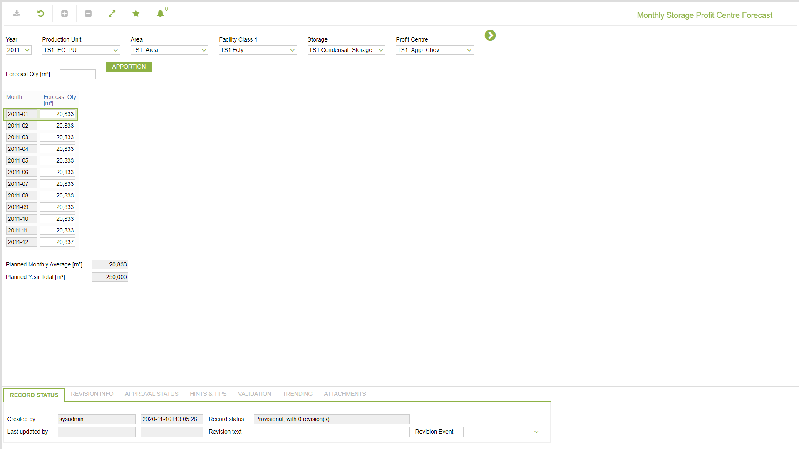

# CP.0009 - Monthly Storage Profit Centre Forecast

_Deep-dive 2026-07-06 (deterministic runner). Module: CP._

## Identity
- BF_CODE: CP.0009 - URL: `/com.ec.tran.cp.screens/monthly_stor_pc_forecast`

## DB binding (metadata-resolved)
| Class | Type/Scope | Base table | View |
|---|---|---|---|
| `STOR_MTH_PLAN_RECEIPT` | DATA/MTH | `STOR_MTH_PC_FORECAST` | `DV_STOR_MTH_PLAN_RECEIPT` |

_Resolved by: label (exact, unique)_

## Screen type
DATA/MTH

## Help (screen screenshot -- local online-help corpus 14.2.5)

## Help (field-description images -- local online-help corpus 14.2.5)
_(no field-description images in corpus for this BF_CODE)_
