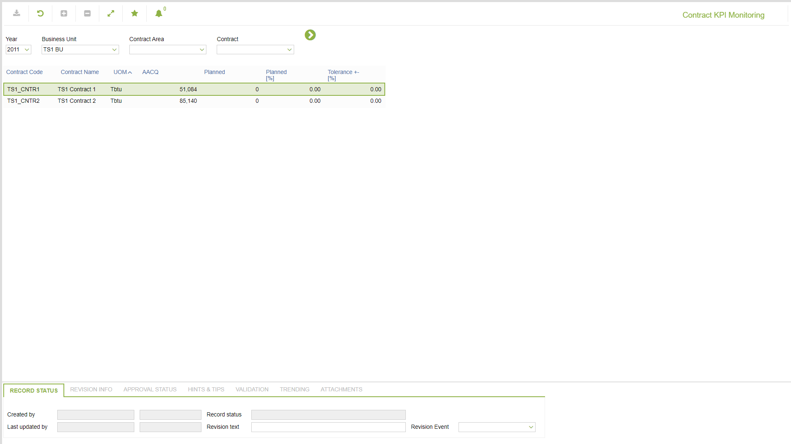

# CP.0027 - Contract KPI Monitoring

_Deep-dive 2026-07-06 (deterministic runner). Module: CP._

## Identity
- BF_CODE: CP.0027 - URL: `/com.ec.tran.cp.screens/contract_KPI_monitoring/CLASS/CONTRACT_KPI_MONITORING/NAV_MODEL/TRAN_COMMERCIAL/BF_PROFILE/CP.0027`

## DB binding (metadata-resolved)
| Class | Type/Scope | Base table | View |
|---|---|---|---|
| `CONTRACT_KPI_MONITORING` | DATA/YR | `V_CONTRACT_YEAR` | `DV_CONTRACT_KPI_MONITORING` |

_Resolved by: label (exact, unique)_

## Screen type
DATA/YR

## Help (screen screenshot -- local online-help corpus 14.2.5)

## Help (field-description images -- local online-help corpus 14.2.5)
_(no field-description images in corpus for this BF_CODE)_
